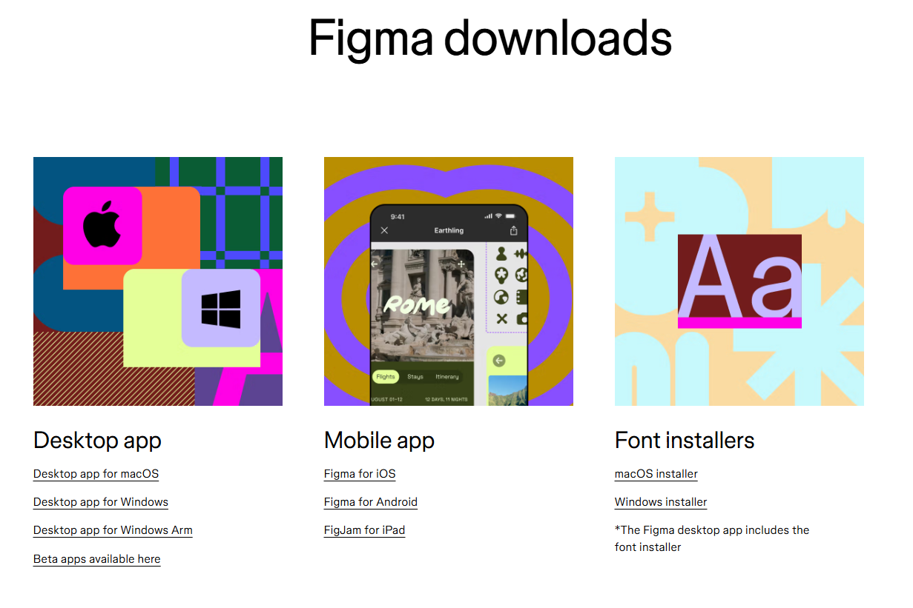
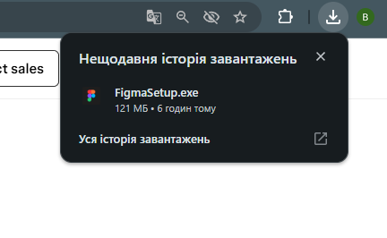
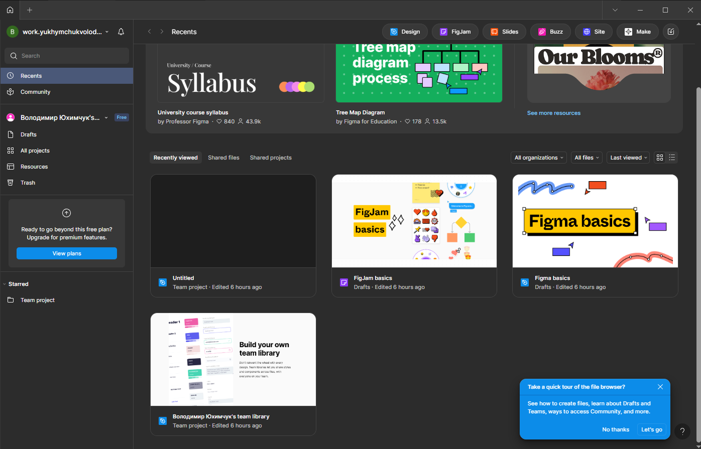

# ПЗ-1 ОГЛЯД І ПОРІВНЯЛЬНА ХАРАКТЕРИСТИКА СЕРВІСІВ ДЛЯ ПРОЕКТУВАННЯ КОРИСТУВАЛЬНИЦЬКИХ ІНТЕРФЕЙСІВ  

## Тема заняття
Протокол встановлення десктопної версії Figma  

---

## Хід роботи

### Крок 1. Перехід на офіційний сайт Figma
Для початку я відкрив браузер і перейшов на сайт [https://www.figma.com/downloads/](https://www.figma.com/downloads/), де доступні офіційні версії програми для Windows та macOS.  

---

### Крок 2. Завантаження інсталятора
Натиснув кнопку **Download for Windows**. Завантажився файл-інсталятор.  

---

### Крок 3. Встановлення програми
Запустив завантажений файл інсталятора. Встановлення відбулося автоматично без додаткових налаштувань.  

---

### Крок 4. Запуск програми та авторизація
Після завершення встановлення відкрив програму **Figma Desktop**. Для входу необхідно авторизуватись через акаунт Figma (Google або Email).  

---

## Висновки
- Я завантажив та встановив десктопну версію Figma
- Виконав початковий запуск і авторизацію.  
---
