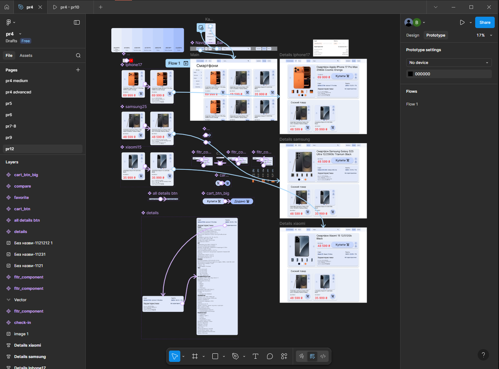
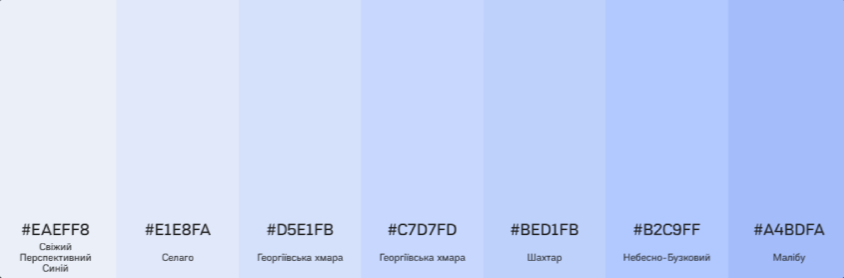
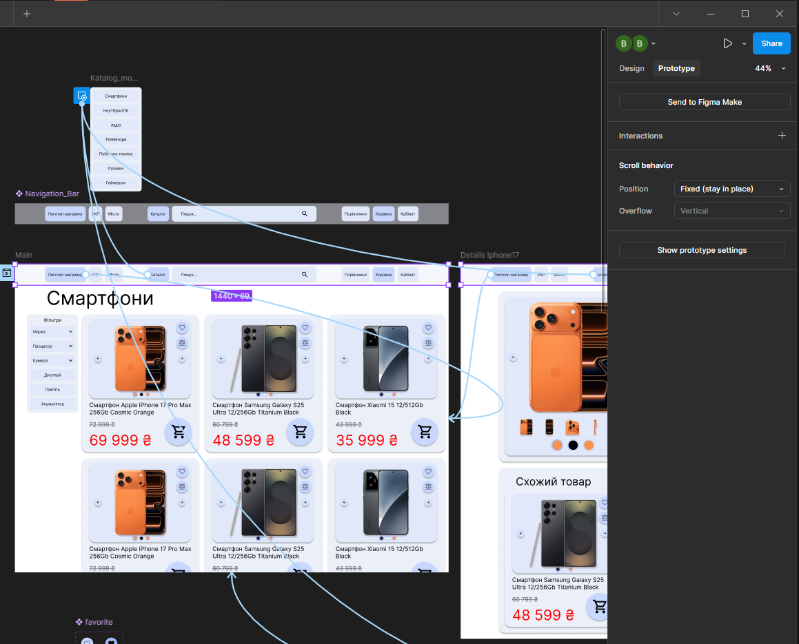
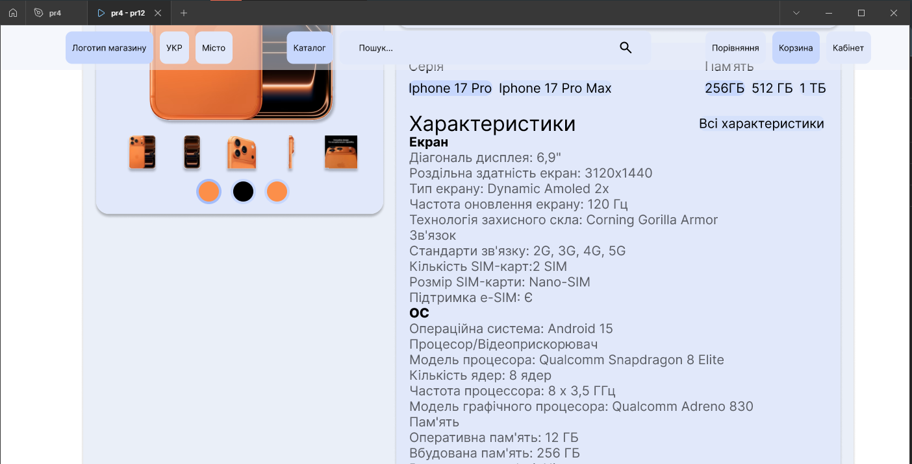
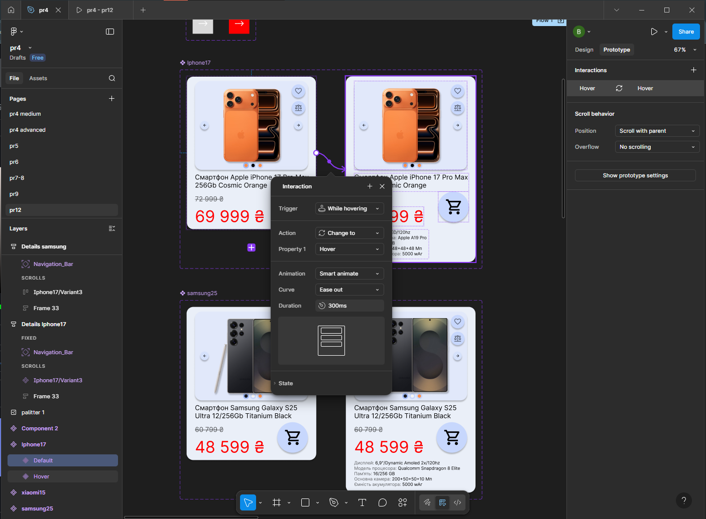
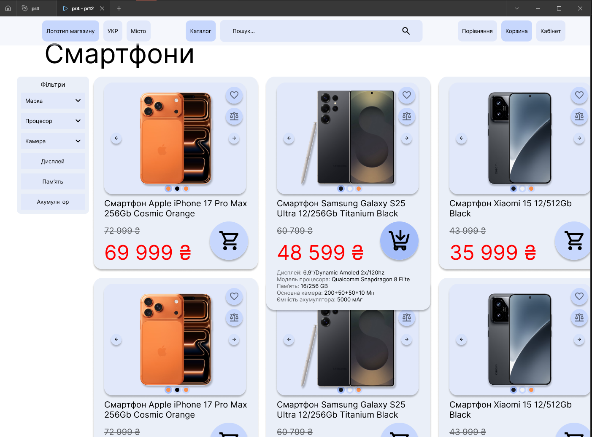
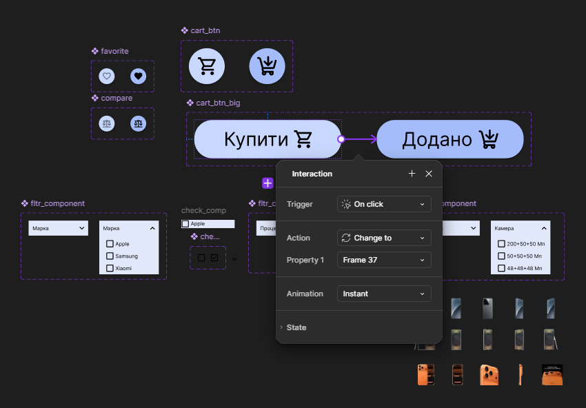
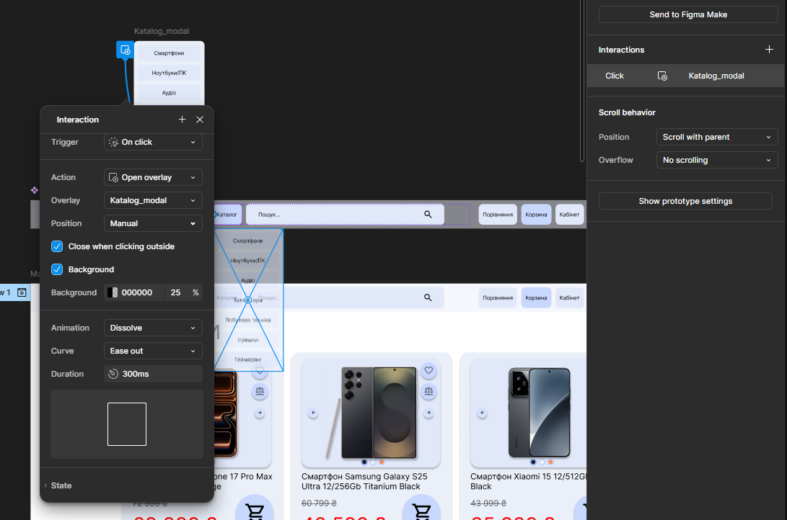
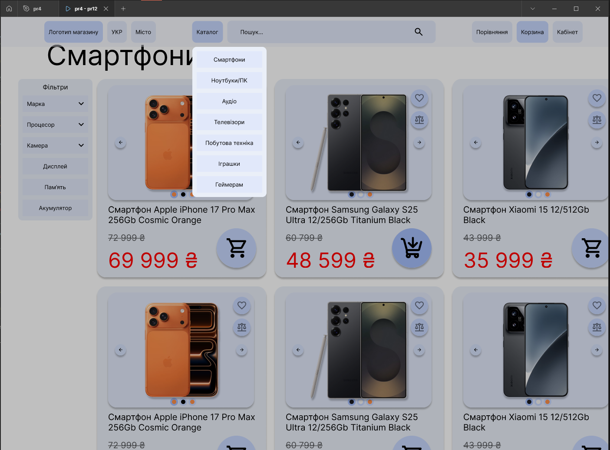
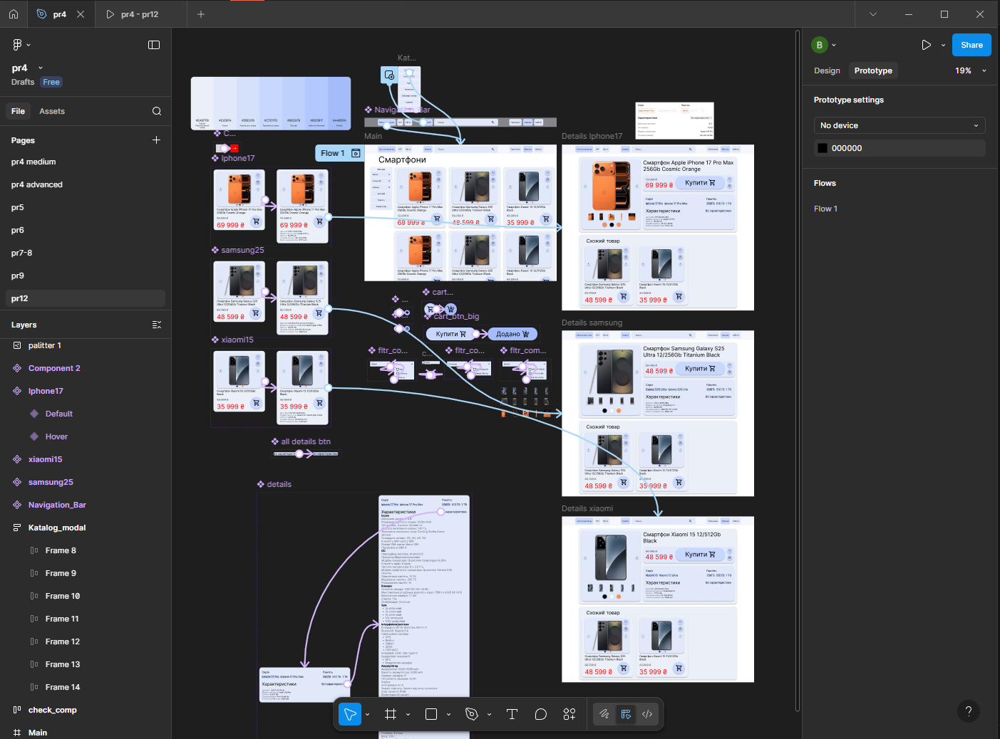

# ПЗ-12 Розробка wireframe

## Тема заняття  
Створення деталізованого вайрфрейму та клікабельного прототипу інтернет-магазину електроніки у Figma. Використання компонентів, component sets, прототипування з інтерактивними переходами та модальними вікнами.

---

## Хід роботи  

### 1. Опрацювання теоретичного матеріалу  
Я опрацював теоретичний матеріал з наступних джерел:

- [Що таке вайрфрейм, мокап і прототип](https://skvot.io/uk/blog/ne-soromno-zapitati-shcho-take-vayrfreym-mokap-i-prototip?authuser=0) — основні поняття та відмінності між етапами проєктування;  
- [Відео "Основи створення вайрфреймів"](https://www.youtube.com/watch?v=Sdmk050xcDA&authuser=0);  
- [Відео "Прототипування у Figma"](https://www.youtube.com/watch?v=fe_QfW-6i4w&authuser=0);  
- [Відео "Інтерактивні компоненти"](https://www.youtube.com/watch?v=Lis9V4rYPzY&authuser=0).

Основні поняття, які я засвоїв:  
- **Вайрфрейм (Wireframe)** — схематичне зображення структури сторінки без деталізації дизайну;  
- **Прототип (Prototype)** — інтерактивна модель інтерфейсу з можливістю переходів між екранами;  
- **Компоненти (Components)** — повторювані елементи інтерфейсу, які можна редагувати централізовано;  
- **Component Sets** — набори варіантів компонента з різними станами (default, hover, pressed тощо);  
- **Auto layout** — автоматичне розташування елементів з можливістю адаптації.

---

### 2. Виконання практичного завдання  

#### 2.1. Вибір тематики та структури сайту
Я обрав тематику **інтернет-магазину електроніки** (смартфони, ноутбуки, аудіо, телевізори, побутова техніка).

Структура сайту включає:
- **Головну сторінку** з навігацією, каталогом товарів та фільтрами;
- **Сторінки товару** (iPhone 17 Pro Max, Samsung Galaxy S25, Xiaomi 15) з детальною інформацією, характеристиками та схожими товарами.

---

#### 2.2. Використання кольорової гармонії
Для створення гармонійного інтерфейсу я використав **монохроматичну кольорову схему** з акцентами:

- **Основний колір фону**: світло-блакитний (#E8EEF7) для створення спокійної атмосфери;
- **Нейтральні кольори**: сірий (#6B7280) для тексту характеристик, білий (#FFFFFF) для карток товарів;
- **Колір ціни**: червоний (#EF4444) для привернення уваги до вартості товару.

Така кольорова гармонія забезпечує **контраст**, **читабельність** та **фокусування уваги** на ключових елементах (ціна, кнопки дій).

---

#### 2.3. Створення компонентів

##### Header (Навігаційна панель)
Я створив **компонент Header**, який включає:
- логотип магазину;
- кнопки навігації ("Логотип магазину", "УКР", "Місто", "Каталог", "Пошук...");
- кнопки користувача ("Порівняння", "Корзина", "Кабінет").

**Особливості компонента Header:**
- **Фіксоване положення**: Header має властивість `Fix position when scrolling`, що дозволяє йому залишатися зверху при прокручуванні сторінки;
- **Винесення поза межі макетів**: Header створено як окремий main component, який використовується на всіх сторінках як instance;
- **Централізоване редагування**: зміни у батьківському компоненті автоматично відображаються у всіх дочірніх екземплярах, що значно спрощує підтримку дизайну.

---

##### Картка товару (Component Set)
Для карток товарів я створив **Component Set** з двома варіантами:

1. **Default (звичайний стан)**:
   - компактне зображення товару;
   - назва товару;
   - ціна;
   - іконки дій (обране, порівняти, кошик).

2. **Hover (стан при наведенні)**:
   - картка збільшується;
   - з'являються **основні характеристики товару** (екран, процесор, пам'ять, камера);
   - підсвічуються іконки дій.

**Переваги Component Set:**
- автоматична зміна стану при наведенні курсора в режимі прототипу;
- єдиний компонент для різних станів — легше підтримувати;
- можливість додавати нові варіанти (pressed, disabled тощо).

---

##### Кнопки дій (Component Set)
Для кнопок "Купити", "Додано", "Обране" я створив **Component Set** з різними станами:

- **Default**: звичайний стан кнопки;
- **Pressed/Active**: стан після натискання (змінюється колір, текст або іконка).

Наприклад:
- Кнопка "Купити" → після натискання змінюється на "Додано" з іншим кольором;
- Іконка "Обране" → після натискання заповнюється кольором (стає активною).

---

#### 2.4. Модальне вікно "Каталог"

Я створив **модальне вікно "Каталог"**, яке відкривається при натисканні на кнопку "Каталог" у Header.

**Особливості модального вікна:**
- **Manual positioning**: вікно має ручне позиціонування для точного розміщення;
- **Затемнення фону**: при відкритті вікна фон затемнюється (overlay з напівпрозорим чорним кольором);
- **Закриття кліком поза межами**: налаштовано прототипування так, що клік поза межами вікна закриває його;
- **Список категорій**: Смартфони, Ноутбуки/ПК, Аудіо, Телевізори, Побутова техніка, Іграшки, Гаджети/Аксесуари.

---

#### 2.5. Прототипування та інтерактивність

Я налаштував **клікабельний прототип** з наступними взаємозв'язками:

1. **Навігація між сторінками**:
   - клік на картку товару → перехід на сторінку деталей товару;
   - клік на категорію у модальному вікні → перехід на відповідну категорію товарів;
   - клік на логотип → повернення на головну сторінку.

2. **Інтерактивні елементи**:
   - кнопка "Каталог" → відкриття модального вікна;
   - клік поза межами модального вікна → закриття вікна;
   - наведення на картку товару → зміна стану на Hover з характеристиками;
   - клік на кнопку "Купити" → зміна стану на "Додано".

3. **Фіксований Header**:
   - при прокручуванні сторінки Header залишається зверху завдяки властивості `Fix position`.

---

### 3. Результат  

В результаті виконання практичної роботи я створив:

- **Деталізований вайрфрейм** інтернет-магазину електроніки з 4 сторінками (головна + 3 сторінки товарів);
- **Клікабельний прототип** з інтерактивними переходами, модальними вікнами та зміною станів компонентів;
- **Систему компонентів**: Header, картки товарів, кнопки, модальне вікно;
- **Component Sets** для карток товарів та кнопок з різними станами;
- **Адаптивний дизайн** з використанням Auto layout та фіксованого Header.

Результат(відео):

https://github.com/user-attachments/assets/7f7b0096-a7ca-442c-aa3e-432ae5b7f9d6

---

## Висновок  

Під час виконання практичного завдання я:

- **Опанував створення вайрфреймів** для багатосторінкових інтерфейсів;
- **Навчився працювати з компонентами та Component Sets** для створення інтерактивних елементів з різними станами;
- **Застосував прототипування** для створення клікабельного прототипу з переходами між сторінками;
- **Використав модальні вікна** з затемненням фону та закриттям кліком поза межами;
- **Реалізував фіксований Header**, який залишається зверху при прокручуванні;
- **Застосував кольорову гармонію** для створення естетично приємного та функціонального інтерфейсу;
- **Зрозумів переваги централізованого редагування компонентів** — зміни у батьківському компоненті автоматично відображаються у всіх екземплярах.

Ця робота допомогла мені зрозуміти повний цикл створення інтерактивного прототипу — від вайрфрейму до клікабельної моделі, яку можна використовувати для тестування UX та презентації клієнтам.

---

## [Посилання на роботу у Figma(page pr12)](https://www.figma.com/design/XKeWMfdrukhDuCxJJBvJUd/pr4?node-id=47-2&p=f&t=XXyTG5bnRuy6uvnb-0)
