# ПЗ-13 Дослідження кольорових гармоній та інструментів аналізу кольору в Adobe Color

## Тема заняття  
Дослідження кольорових гармоній та інструментів аналізу кольору в Adobe Color. Створення палітр за різними принципами гармонії, виділення кольорів із зображень, створення градієнтів та перевірка контрастності відповідно до стандартів доступності WCAG.

---

## Хід роботи  

### 1. Опрацювання теоретичного матеріалу  

Я опрацював теоретичний матеріал з наступних тем:

#### 1.1. Що таке кольорова гармонія і навіщо вона потрібна в дизайні?

**Кольорова гармонія** — це збалансоване поєднання кольорів, яке створює естетично приємне та функціональне враження. У дизайні інтерфейсів кольорова гармонія виконує кілька важливих функцій:

- **Естетика**: створює візуально приємний вигляд;
- **Ієрархія**: допомагає виділити важливі елементи;
- **Емоційний вплив**: викликає певні емоції та асоціації;
- **Читабельність**: забезпечує комфортне сприйняття інформації;
- **Брендинг**: формує впізнаваність бренду.

#### 1.2. Типи кольорової гармонії

- **Analogous (аналогічна)** — кольори, розташовані поруч на колірному колесі (наприклад, жовтий, помаранчевий, червоний);
- **Monochromatic (монохроматична)** — відтінки одного кольору з різною яскравістю та насиченістю;
- **Triad (тріада)** — три кольори, рівновіддалені на колірному колесі (утворюють трикутник);
- **Complementary (комплементарна)** — протилежні кольори на колірному колесі (максимальний контраст);
- **Split Complementary (розділена комплементарна)** — базовий колір і два кольори, сусідні до його комплементарного;
- **Square (квадратна)** — чотири кольори, рівновіддалені на колірному колесі (утворюють квадрат);
- **Compound (складна)** — комбінація кількох типів гармоній;
- **Shades (відтінки)** — варіації одного кольору від світлого до темного;
- **Custom (власна побудова)** — довільна комбінація кольорів за власним вибором.

#### 1.3. Колірні моделі RGB, HSB, LAB

- **RGB (Red, Green, Blue)** — адитивна модель, використовується для екранів. Колір формується шляхом змішування червоного, зеленого та синього світла;
- **HSB (Hue, Saturation, Brightness)** — модель, заснована на відтінку, насиченості та яскравості. Інтуїтивно зрозуміла для дизайнерів;
- **LAB (Lightness, A, B)** — модель, незалежна від пристрою, що відображає людське сприйняття кольору. L — яскравість, A — від зеленого до червоного, B — від синього до жовтого.

#### 1.4. Перевірка доступності через контрастність

**Контрастне співвідношення** — це числове значення, що показує різницю між яскравістю двох кольорів. Чим вище значення, тим легше розрізнити текст на фоні.

**Стандарти WCAG 2.1:**
- **Рівень AA**: мінімальний контраст 4.5:1 для звичайного тексту, 3:1 для великого тексту;
- **Рівень AAA**: контраст 7:1 для звичайного тексту, 4.5:1 для великого тексту.

Ці стандарти забезпечують доступність інтерфейсів для людей з порушеннями зору.

---

### 2. Виконання практичного завдання  

#### 2.1. Робота з колірним колесом (Color Wheel)

Я створив палітри для кожного типу гармонії, використовуючи Adobe Color. Базовий колір для більшості гармоній — **темно-сірий (#505050)**, який є універсальним та нейтральним.

##### 2.1.1. Analogous (Аналогічна гармонія)

**Базовий колір**: #EB7A5B (помаранчево-червоний)

**Палітра**:
- #EB5F57 (червоно-помаранчевий)
- #EB9257 (яскраво-помаранчевий)
- #EB7A5B (базовий помаранчевий)
- #EB5792 (рожево-червоний)
- #EBAD57 (золотисто-помаранчевий)
- #E3B5A5 (світло-персиковий)

**Логіка побудови**: кольори розташовані поруч на колірному колесі в діапазоні від червоно-помаранчевого до золотистого.

**Емоційний ефект**: тепла, енергійна, дружня атмосфера. Підходить для інтерфейсів, пов'язаних з креативністю, їжею, подорожами.

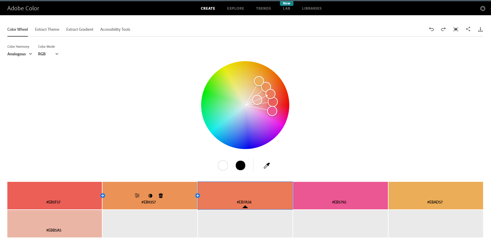

---

##### 2.1.2. Monochromatic (Монохроматична гармонія)

**Базовий колір**: #5796F0 (синій)

**Палітра**:
- #6B8FCA (світло-синій)
- #6B7298 (сіро-синій)
- #5796F0 (базовий синій)
- #606E70 (темно-сіро-синій)
- #363B46 (темно-синій)
- #1F2233 (майже чорний синій)

**Логіка побудови**: відтінки одного синього кольору з різною яскравістю та насиченістю — від світлого до майже чорного.

**Емоційний ефект**: спокійна, професійна, надійна атмосфера. Ідеально підходить для корпоративних інтерфейсів, фінансових додатків, медичних систем.

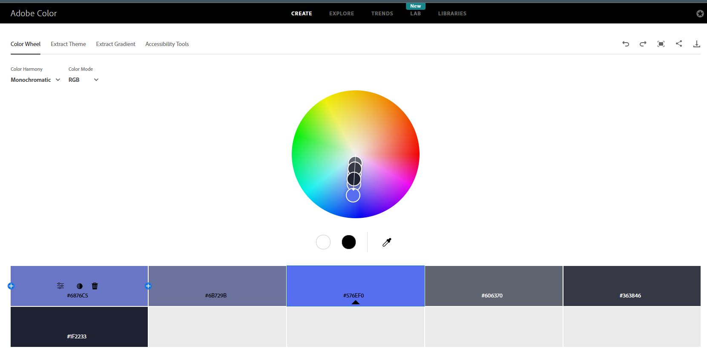

---

##### 2.1.3. Triad (Тріада)

**Базовий колір**: #E6A6E8 (рожево-фіолетовий)

**Палітра**:
- #6CE3CD (м'ятно-бірюзовий)
- #E6CE5A (золотисто-жовтий)
- #E6A6E8 (базовий рожево-фіолетовий)
- #97738C (приглушений фіолетовий)
- #666856 (оливково-сірий)

**Логіка побудови**: три кольори, рівновіддалені на колірному колесі (120° між кожним). Утворюють рівносторонній трикутник.

**Емоційний ефект**: яскрава, динамічна, збалансована палітра. Підходить для креативних проєктів, дитячих додатків, розважальних платформ.

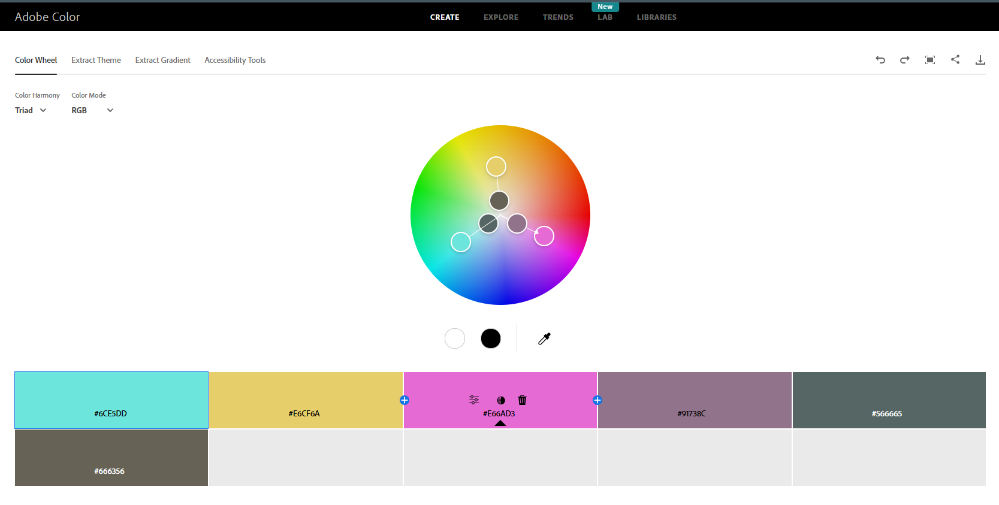

---

##### 2.1.4. Complementary (Комплементарна гармонія)

**Базовий колір**: #E55045 (червоно-помаранчевий)

**Палітра**:
- #45E5A1 (м'ятно-зелений)
- #A66658 (теракотовий)
- #E55045 (червоно-помаранчевий)
- #5C917A (приглушений зелений)
- #685552 (темно-коричневий)
- #323C37 (темно-сірий з зеленим відтінком)

**Логіка побудови**: протилежні кольори на колірному колесі (180°). Червоно-помаранчевий і м'ятно-зелений створюють максимальний контраст.

**Емоційний ефект**: енергійна, контрастна, привертає увагу. Підходить для акцентів, кнопок дій, важливих повідомлень.

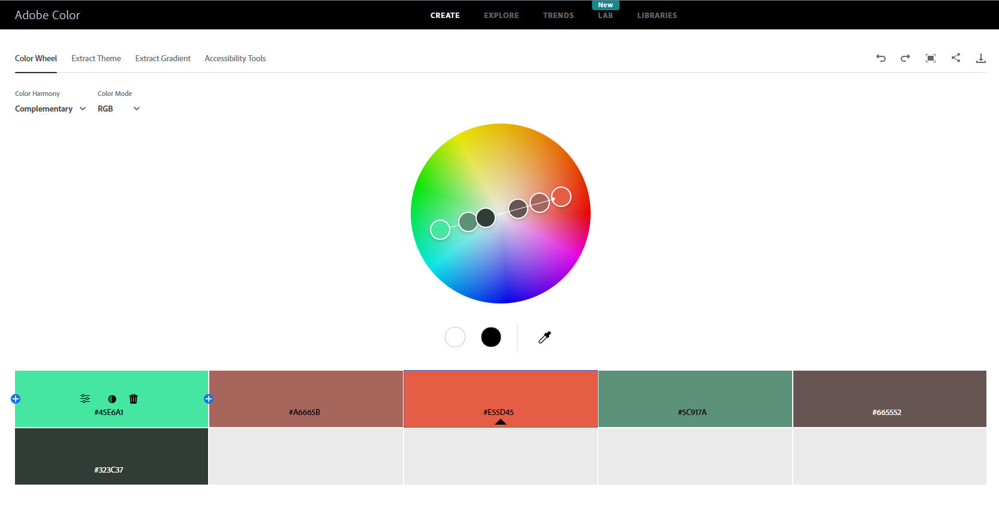

---

##### 2.1.5. Split Complementary (Розділена комплементарна гармонія)

**Базовий колір**: #E6C04E (золотисто-жовтий)

**Палітра**:
- #8D4FE6 (фіолетовий)
- #4E7FE6 (синій)
- #E6C04E (базовий золотисто-жовтий)
- #666A56 (оливково-сірий)
- #5E6866 (темно-сірий)

**Логіка побудови**: базовий колір (жовтий) і два кольори, сусідні до його комплементарного (фіолетовий і синій замість прямого фіолетового).

**Емоційний ефект**: збалансована, менш контрастна, ніж комплементарна, але все ще динамічна. Підходить для інтерфейсів з акцентами без надмірної агресивності.

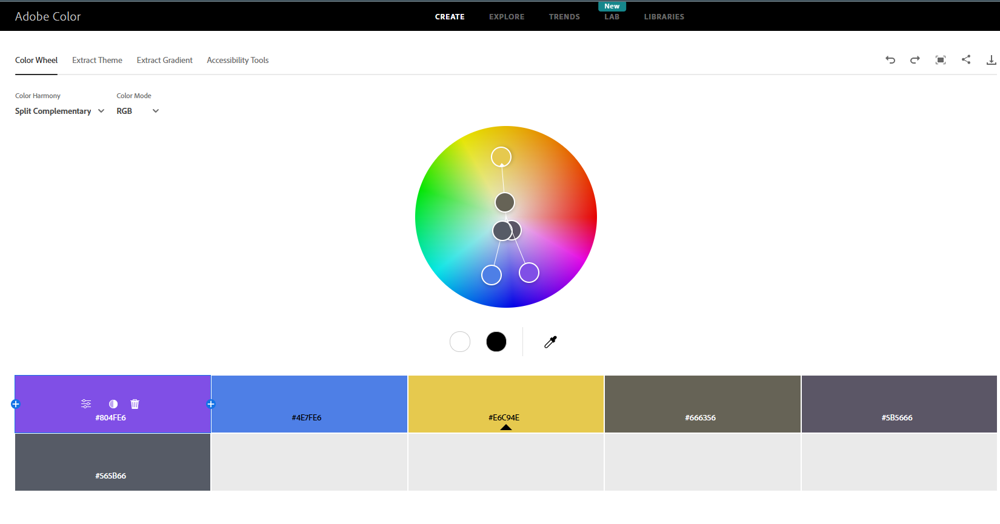

---

##### 2.1.6. Square (Квадратна гармонія)

**Базовий колір**: #505050 (темно-сірий)

**Палітра**:
- #4EE663 (яскраво-зелений)
- #E6B04E (золотисто-помаранчевий)
- #4E63E6 (синій)
- #E65B7B (рожево-червоний)
- #616C5F (оливково-сірий)
- #566658 (темно-зелено-сірий)

**Логіка побудови**: чотири кольори, рівновіддалені на колірному колесі (90° між кожним). Утворюють квадрат.

**Емоційний ефект**: різноманітна, яскрава, але збалансована палітра. Підходить для багатофункціональних інтерфейсів, дашбордів, інфографіки.

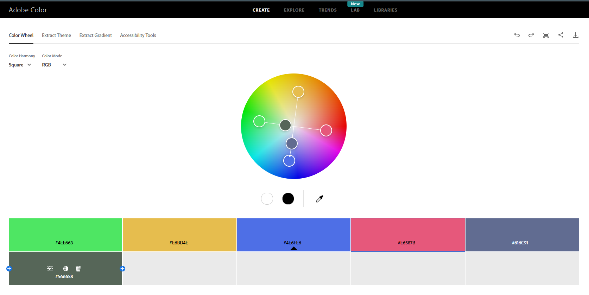

---

##### 2.1.7. Compound (Складна гармонія)

**Базовий колір**: #505050 (темно-сірий)

**Палітра**:
- #6F3CF9 (фіолетовий)
- #64FE5C (яскраво-зелений)
- #BA33E9 (пурпурний)
- #E4F600 (лимонно-жовтий)
- #8646A1 (темно-фіолетовий)
- #3F2C56 (темно-пурпурний)

**Логіка побудови**: комбінація кількох типів гармоній. Використовує як комплементарні, так і тріадні відношення.

**Емоційний ефект**: експресивна, креативна, нестандартна. Підходить для мистецьких проєктів, музичних додатків, молодіжних брендів.

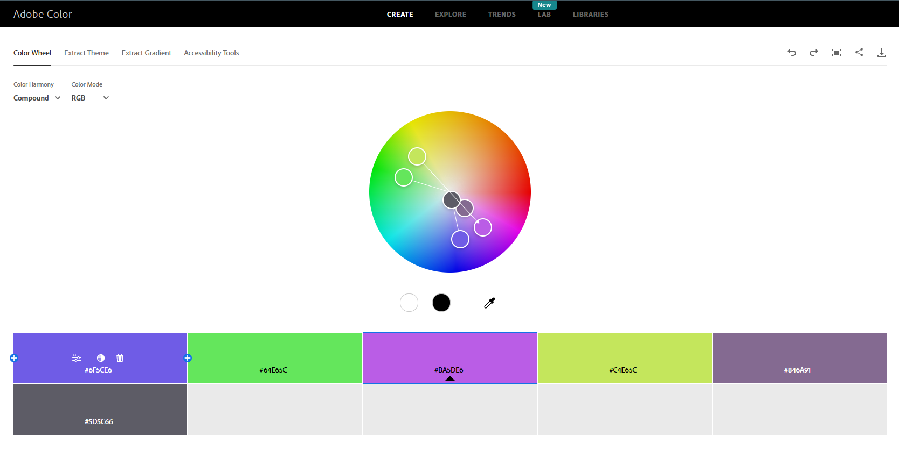

---

##### 2.1.8. Shades (Відтінки)

**Базовий колір**: #5C6LL6 (синій)

**Палітра**:
- #5D6A1D3 (світло-синій)
- #4054AB (середньо-синій)
- #5C6LL6 (базовий синій)
- #3D4999 (темно-синій)
- #303977 (дуже темно-синій)
- #222055 (майже чорний синій)

**Логіка побудови**: варіації одного синього кольору від світлого до темного. Схоже на монохроматичну гармонію, але з акцентом на зміну яскравості.

**Емоційний ефект**: спокійна, глибока, професійна. Підходить для нічних режимів, мінімалістичних інтерфейсів, технічних додатків.

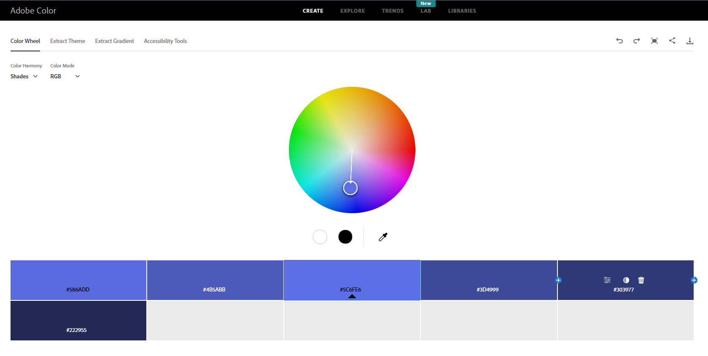

---

##### 2.1.9. Custom (Власна побудова)

**Базовий колір**: #505050 (темно-сірий)

**Палітра**:
- #D3e9F1 (рожево-фіолетовий)
- #544C1BD (темно-синій)
- #31C5B5 (бірюзовий)
- #39F5B8 (яскраво-м'ятний)
- #F5AE32A (помаранчевий)
- #5E3C36 (темно-коричневий)

**Логіка побудови**: довільна комбінація кольорів, обрана інтуїтивно для створення унікальної палітри. Поєднує холодні (бірюзовий, синій) та теплі (помаранчевий, рожевий) відтінки.

**Емоційний ефект**: унікальна, експериментальна, творча. Підходить для авторських проєктів, стартапів, нестандартних рішень.

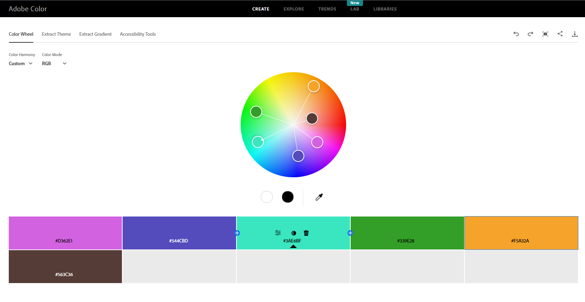

---

#### 2.2. Створення палітри зображенням (Extract Theme)

Я завантажив зображення спортивного автомобіля на снігу у розділ **Extract Theme** та створив дві палітри з різними настроями.

##### 2.2.1. Colorful (Яскрава палітра)

**Палітра**:
- #8C3A50 (темно-червоний)
- #D9115A (яскраво-рожевий)
- #F2F2F9 (світло-сірий)
- #8CB37B (приглушений зелений)
- #262626 (темно-сірий)

**Опис**: палітра виділяє яскраві акценти з зображення — червоні елементи автомобіля, контрастуючи з нейтральними сірими та зеленими відтінками снігу та фону.

**Чи підходить для інтерфейсу додатку?**: Так, підходить для динамічних додатків (спортивні, автомобільні, ігрові), де потрібні яскраві акценти для привернення уваги.

**Чому?**: Яскраво-рожевий (#D9115A) ідеально підходить для кнопок дій (CTA), темно-червоний (#8C3A50) — для акцентів, а нейтральні кольори (#F2F2F9, #262626) — для фону та тексту.

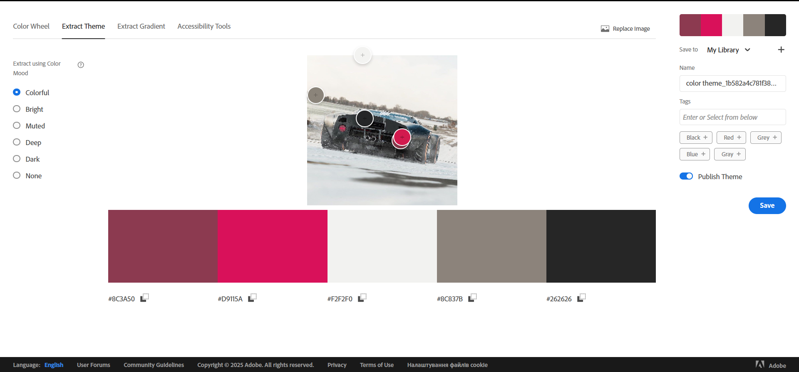

---

##### 2.2.2. Muted (Приглушена палітра)

**Палітра**:
- #D00056 (насичений рожевий)
- #D2D7D9 (світло-сірий)
- #3A3F40 (темно-сірий)
- #F2FFFB (майже білий)
- #8CB37B (приглушений зелено-коричневий)

**Опис**: палітра зберігає основні кольори, але з меншою насиченістю. Більше уваги приділено нейтральним відтінкам.

**Чи підходить для інтерфейсу додатку?**: Так, ідеально підходить для професійних, мінімалістичних інтерфейсів (фінанси, продуктивність, освіта).

**Чому?**: Приглушені кольори створюють спокійну атмосферу, не відволікають увагу, забезпечують високу читабельність. Насичений рожевий (#D00056) можна використовувати для акцентів, а нейтральні відтінки — для основного контенту.

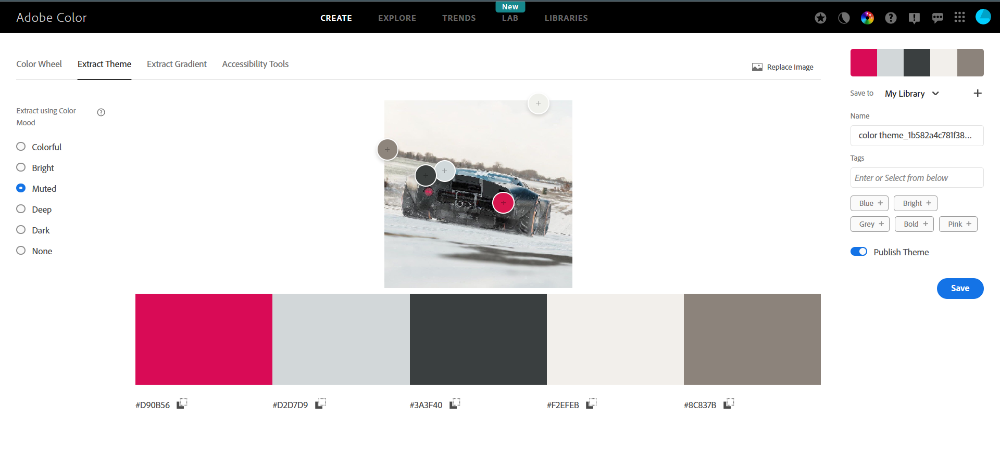

---

**Висновок**: для інтерфейсу додатку краще підходить **Muted палітра**, оскільки вона забезпечує кращу читабельність, менше втомлює очі та створює професійний вигляд. **Colorful палітра** підходить для акцентів та динамічних елементів, але не для основного контенту.

---

#### 2.3. Створення градієнту на основі зображення (Extract Gradient)

Я завантажив те саме зображення спортивного автомобіля у розділ **Extract Gradient** та створив градієнт з п'ятьма кольоровими точками.

**Градієнт**:
- **Точка 1**: #E5E4E0 (світло-сірий) — RGB 245, 244, 240 | HSB 48, 2, 96
- **Точка 2**: #E0DCD3 (бежево-сірий) — RGB 224, 220, 211 | HSB 42, 6, 88
- **Точка 3**: #475050 (темно-сірий) — RGB 71, 80, 89 | HSB 210, 20, 35
- **Точка 4**: #2D2B2D (майже чорний) — RGB 43, 43, 45 | HSB 240, 4, 18
- **Точка 5**: #D9DDDC (світло-сірий) — RGB 217, 221, 220 | HSB 165, 2, 87

**Опис градієнта**: плавний перехід від світлих відтінків (сніг, небо) до темних (тіні, асфальт). Градієнт відображає природне освітлення сцени — від світлого верху до темного низу.

**Застосування**: такий градієнт можна використовувати для фонів, хедерів, карток товарів, створюючи ефект глибини та об'єму.

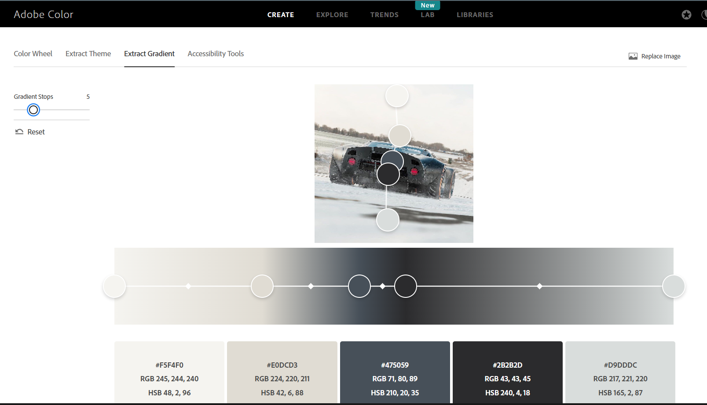

---

#### 2.4. Аналіз контрасту (Accessibility Tools)

Я використав **Accessibility Tools** для перевірки контрастності кольорової пари з попередніх палітр.

**Обрана пара кольорів**:
- **Текст**: #940538 (темно-червоний)
- **Фон**: #F2F2F0 (світло-сірий)

**Результат перевірки**:
- **Контрастне співвідношення**: **8.01:1** 
- **Звичайний текст (AA)**: Проходить (мінімум 4.5:1)
- **Великий текст (AAA)**: Проходить (мінімум 4.5:1)
- **Звичайний текст (AAA)**: Проходить (мінімум 7:1)

**Висновок**: ця пара кольорів має **відмінну контрастність** і відповідає найвищим стандартам доступності WCAG 2.1 (рівень AAA). Вона підходить для будь-якого типу тексту, включаючи дрібний шрифт, і забезпечує комфортне читання для людей з порушеннями зору.

**Додаткові рекомендації**: Adobe Color запропонував ще більш контрастні варіанти (10.1:1, 11.01:1, 12.01:1), але поточне співвідношення 8.01:1 вже є оптимальним для більшості випадків.

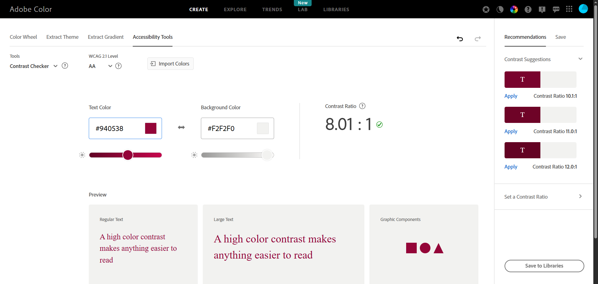

---

### 3. Результат  

В результаті виконання практичної роботи я:

- **Створив 9 типів кольорових гармоній** (Analogous, Monochromatic, Triad, Complementary, Split Complementary, Square, Compound, Shades, Custom) з детальним описом кожної;
- **Виділив кольорові палітри з зображення** у двох варіантах настрою (Colorful та Muted) та проаналізував їх придатність для інтерфейсів;
- **Створив градієнт на основі зображення** з п'ятьма кольоровими точками, що відображає природне освітлення;
- **Перевірив контрастність кольорової пари** (#940538 на #F2F2F0) та підтвердив відповідність стандартам WCAG 2.1 (рівень AAA);

---

## Висновок  

Під час виконання практичного завдання я:

- **Опанував роботу з колірним колесом** та навчився створювати гармонійні палітри за різними принципами;
- **Зрозумів різницю між типами гармоній** та їх емоційний вплив на користувача;
- **Навчився виділяти кольори з зображень** та адаптувати їх для інтерфейсів (Colorful vs Muted);
- **Освоїв створення градієнтів** на основі реальних зображень для фонів та декоративних елементів;
- **Перевірив контрастність кольорів** відповідно до стандартів доступності WCAG 2.1 та зрозумів важливість цього для інклюзивного дизайну;
- **Застосував кольорові моделі RGB, HSB, LAB** для точного визначення відтінків.

## Посилання

- [Adobe Color](https://color.adobe.com/)