# ПЗ-14 Оптимізація зображень за допомогою Squoosh

## Тема заняття  
Оптимізація зображень за допомогою Squoosh. Дослідження методів стиснення зображень (lossless та lossy), визначення оптимального балансу між якістю та розміром файлу, адаптація зображень для різних цільових застосувань (веб, мобільні пристрої, Retina-дисплеї).

---

## Хід роботи  

### 1. Опрацювання теоретичного матеріалу  

Я опрацював теоретичний матеріал з наступних тем:

#### 1.1. Що таке Squoosh і як він працює?

**Squoosh** — це безкоштовний веб-інструмент від Google для оптимізації зображень. Він дозволяє:
- Стискати зображення з різними рівнями якості;
- Конвертувати між форматами (JPEG, PNG, WebP, AVIF тощо);
- Порівнювати оригінал і стиснене зображення в реальному часі;
- Змінювати розмір зображень;
- Працювати локально в браузері (без завантаження на сервер).

**Переваги Squoosh:**
- Візуальне порівняння якості до/після стиснення;
- Підтримка сучасних форматів (WebP, AVIF);
- Точне налаштування параметрів стиснення;
- Показ розміру файлу в реальному часі.

#### 1.2. Формати зображень та типи стиснення

**Стиснення без втрати якості (lossless)**:
- **PNG (lossless)** — зберігає всі пікселі без змін, підходить для графіки з текстом, логотипів, скріншотів;
- **WebP (lossless)** — сучасний формат від Google, забезпечує кращу компресію ніж PNG при тій самій якості.

**Стиснення з втратою якості (lossy)**:
- **MozJPEG** — оптимізована версія JPEG з кращою компресією;
- **WebP (lossy)** — забезпечує кращу компресію ніж JPEG при тій самій візуальній якості;
- **AVIF** — найновіший формат з найкращою компресією, але меншою підтримкою браузерів.

#### 1.3. Зміна розміру та її вплив на якість і вагу файлу

Зменшення розміру зображення (resolution) значно зменшує вагу файлу, оскільки:
- Менше пікселів = менше даних для зберігання;
- Для веб-сайтів рідко потрібні зображення більше 1920px по ширині;
- Для мобільних пристроїв достатньо 600-800px.

**Важливо**: зміна розміру — це необоротна операція, тому потрібно зберігати оригінали.

#### 1.4. Оптимізація зображень для Retina-дисплеїв

**Retina-дисплеї** мають подвоєну щільність пікселів (2x) або потроєну (3x). Для збереження чіткості потрібно:
- Створювати зображення у 2x або 3x розмірі;
- Використовувати адаптивні зображення (`srcset` у HTML);
- Балансувати між якістю та розміром файлу (можна зменшити якість стиснення для 2x версій).

---

### 2. Виконання практичного завдання  

#### 2.1. Аналіз вихідних файлів

Я обрав 3 типи зображень для аналізу:

##### 2.1.1. Фотографія (Photo)

**Файл**: `orig_photo_7.2MB.jpg`
- **Формат**: JPEG
- **Розмір**: 7.51 MB (7,506,929 bytes)
- **Тип**: Фотографія з великою кількістю деталей, кольорів та градієнтів

**Характеристики**: Фотографії мають багато кольорових переходів, тіней, текстур. Вони найкраще стискаються форматами з втратою якості (JPEG, WebP lossy).


---

##### 2.1.2. Скріншот (Screenshot)

**Файл**: `orig_screenshot_2.35MB.png`
- **Формат**: PNG
- **Розмір**: 2.44 MB (2,438,462 bytes)
- **Тип**: Скріншот інтерфейсу з текстом, іконками та чіткими межами

**Характеристики**: Скріншоти містять текст, чіткі лінії, обмежену кількість кольорів. Вони добре стискаються як lossless (PNG, WebP lossless), так і lossy форматами при високій якості.

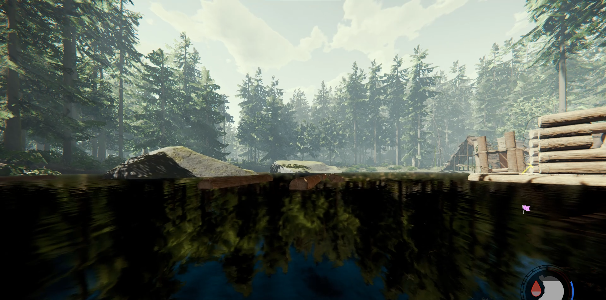

---

##### 2.1.3. Графічне зображення з текстом (Graphics)

**Файл**: `orig_graphics_170kb.png`
- **Формат**: PNG
- **Розмір**: 172 KB (172,197 bytes)
- **Тип**: Графічне зображення з текстом, іконками та чіткими кольорами

**Характеристики**: Графіка з текстом потребує збереження чіткості країв, тому краще використовувати lossless формати або lossy з високою якістю (90-100%).


---

#### 2.2. Стиснення без втрати якості (lossless)

Я використав формати **PNG (lossless)** та **WebP (lossless)** для кожного зображення.

##### 2.2.1. Фотографія (Lossless)

**Результат стиснення**:
- **Оригінал**: 7.51 MB (JPEG)
- **WebP (lossless)**: 2.10 MB
- **Зменшення розміру**: 72% (з 7.51 MB до 2.10 MB)

**Висновок**: Lossless стиснення фотографії дало значне зменшення розміру, але файл все ще великий для веб-використання. Якість залишилася абсолютно незмінною.

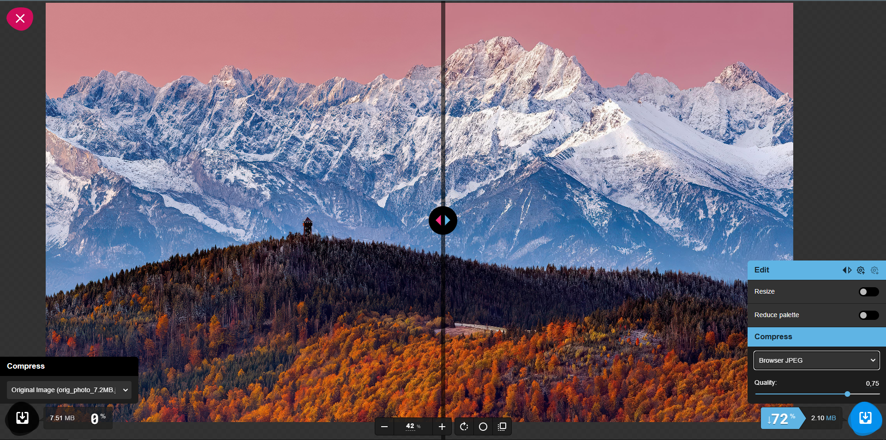

---

##### 2.2.2. Скріншот (Lossless)

**Результат стиснення**:
- **Оригінал**: 2.44 MB (PNG)
- **WebP (lossless)**: 1.44 MB
- **Зменшення розміру**: 41% (з 2.44 MB до 1.44 MB)

**Висновок**: Lossless стиснення скріншоту показало хороший результат. Текст залишився чітким, кольори незмінними. Формат WebP ефективніший за PNG для такого типу зображень.

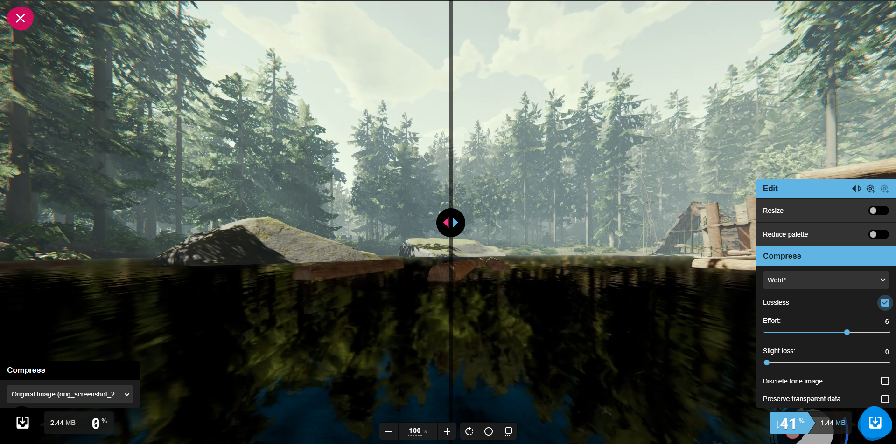

---

##### 2.2.3. Графіка (Lossless)

**Результат стиснення**:
- **Оригінал**: 172 KB (PNG)
- **WebP (lossless)**: 80 KB
- **Зменшення розміру**: 53% (з 172 KB до 80 KB)

**Висновок**: Графічне зображення чудово стиснулося без втрати якості. Текст залишився чітким, кольори точними. Це оптимальний варіант для такого типу контенту.

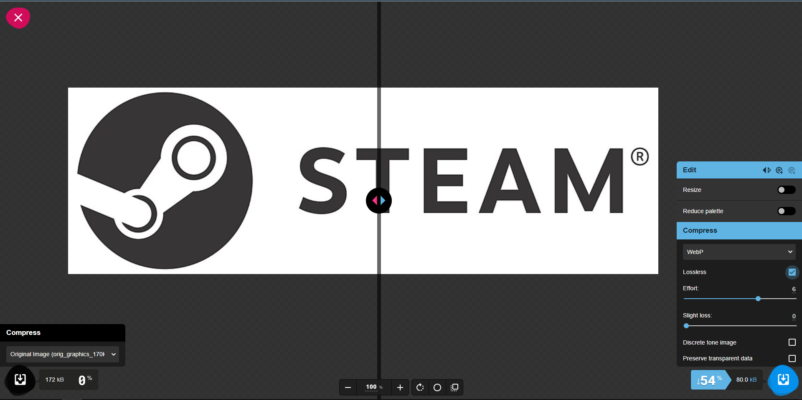

---

#### 2.3. Стиснення з втратою якості (lossy)

Я виконав стиснення на рівнях якості **100%**, **75%** та **50%** для кожного зображення.

##### 2.3.1. Фотографія (Lossy)

| Якість | Розмір файлу | Зменшення від оригіналу | Візуальна якість |
|--------|--------------|-------------------------|------------------|
| **100%** | 3.63 MB | 52% | Відмінна, практично не відрізняється від оригіналу |
| **75%** | 3.49 MB | 54% | Дуже хороша, незначні артефакти в деталях |
| **50%** | 3.46 MB | 54% | Прийнятна, помітні артефакти в градієнтах |

**Мінімальний прийнятний рівень**: **75%** — забезпечує хороший баланс між якістю та розміром.

**Рекомендація**: Для веб-використання оптимально **75%**, для друку або високоякісних презентацій — **100%**.


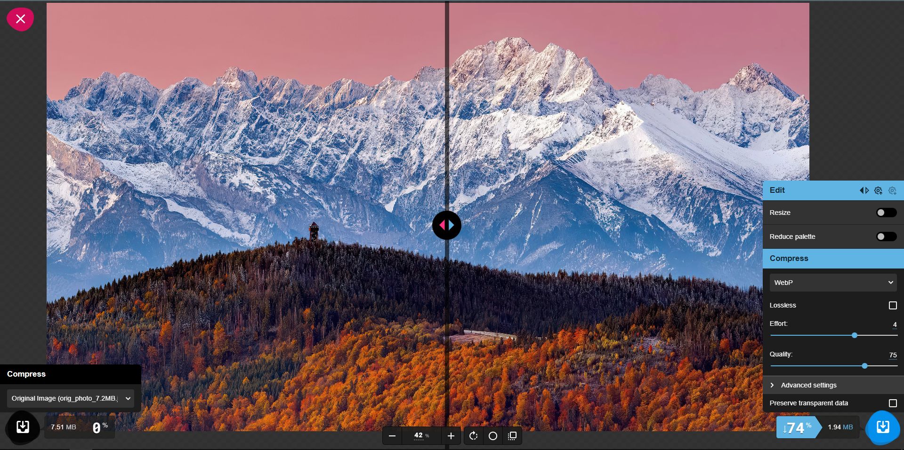

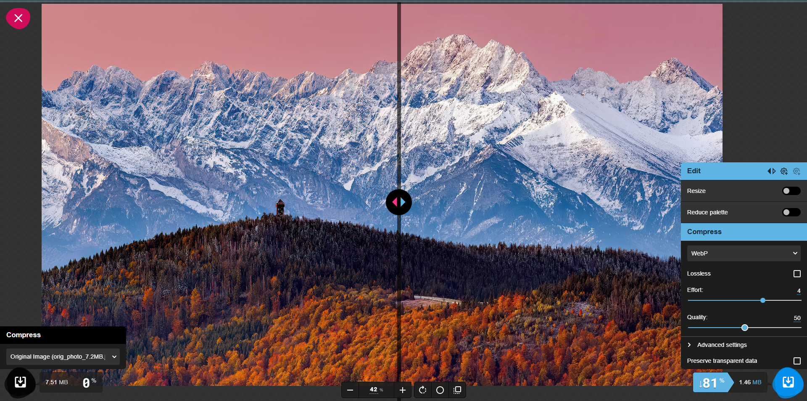

---

##### 2.3.2. Скріншот (Lossy)

| Якість | Розмір файлу | Зменшення від оригіналу | Візуальна якість |
|--------|--------------|-------------------------|------------------|
| **100%** | 2.26 MB | 7% | Відмінна, зображення чітке |
| **75%** | 2.15 MB | 12% | Дуже хороша, зображення прийнятне |
| **50%** | 2.12 MB | 13% | Прийнятна, є розмиття зображення |

**Мінімальний прийнятний рівень**: **75%** — зображення залишається чітким, розмір файлу зменшується.


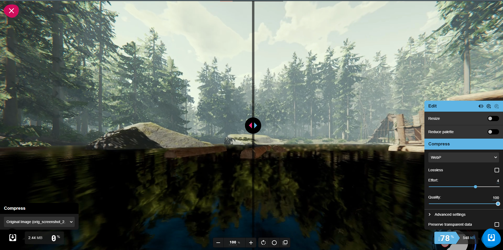


---

##### 2.3.3. Графіка (Lossy)

| Якість | Розмір файлу | Зменшення від оригіналу | Візуальна якість |
|--------|--------------|-------------------------|------------------|
| **100%** | 37.0 KB | 79% | Відмінна, текст чіткий |
| **75%** | 10.4 KB | 95% | Хороша, легке розмиття країв тексту |
| **50%** | 8.61 KB | 96% | Задовільна, помітне розмиття тексту |

**Мінімальний прийнятний рівень**: **100%** — забезпечує відмінну якість тексту та зменшення розміру на 79%.

**Цікаве спостереження**: Lossy стиснення графіки показало **дуже високу ефективність** (79-96% зменшення). Однак при якості 75% і нижче з'являється помітне розмиття тексту, що робить зображення менш читабельним.


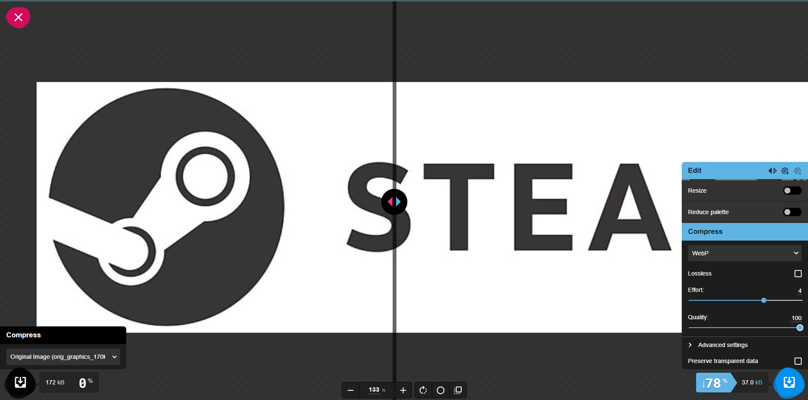
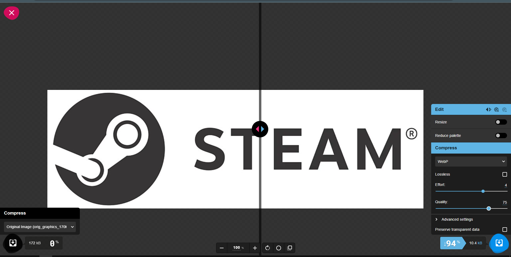
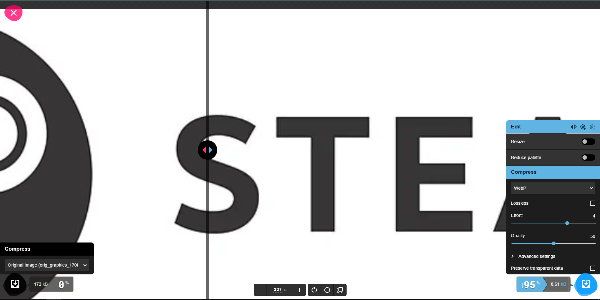

---

#### 2.4. Оптимізація розміру відповідно до цільового використання

Я проаналізував, як зміна розміру впливає на вагу файлу для різних застосувань, використовуючи Squoosh для зміни розміру та стиснення.

##### 2.4.1. Фотографія — оптимізація для різних пристроїв

| Призначення | Розмір (px) | Формат | Якість | Вага файлу | Зменшення від оригіналу |
|-------------|-------------|--------|--------|------------|-------------------------|
| **Оригінал** | - | JPEG | - | 7.51 MB | - |
| **Веб (1x)** | 1200×675 | WebP | 75% | 199 KB | **97.4%** |
| **Мобільні** | 600×338 | WebP | 75% | 48.4 KB | **99.4%** |
| **Retina (2x)** | 2400×1350 | WebP | 75% | 789 KB | **89.5%** |

**Висновки**:
- **Для вебу (1200px)**: зменшення на 97.4% — ідеально для швидкого завантаження на десктопах
- **Для мобільних (600px)**: зменшення на 99.4% — критично важливо для економії мобільного трафіку
- **Для Retina (2400px)**: зменшення на 89.5% — зберігає чіткість на дисплеях високої щільності

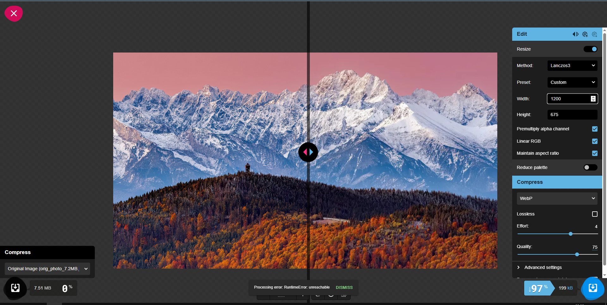
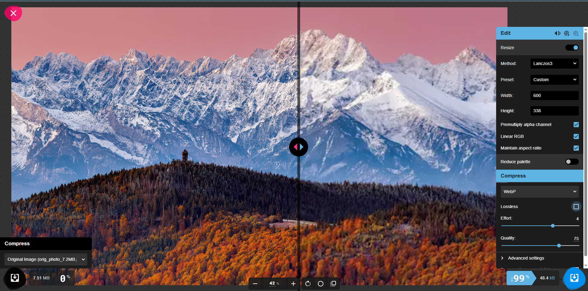
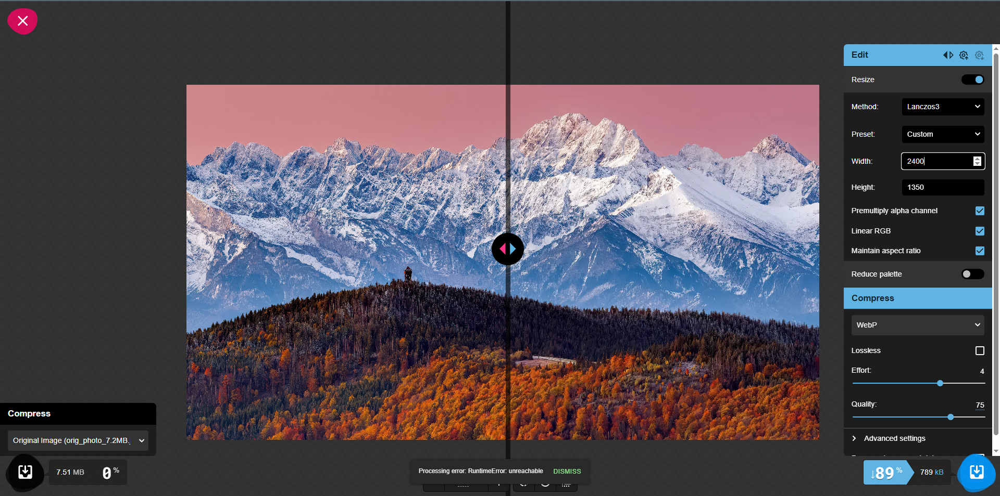

---

##### 2.4.2. Скріншот — оптимізація для різних пристроїв

| Призначення | Розмір (px) | Формат | Якість | Вага файлу | Зменшення від оригіналу |
|-------------|-------------|--------|--------|------------|-------------------------|
| **Оригінал** | - | PNG | - | 2.44 MB | - |
| **Веб (1x)** | 1200×505 | WebP | 75% | 64.6 KB | **97.4%** |
| **Мобільні** | 600×253 | WebP | 75% | 22.7 KB | **99.1%** |
| **Retina (2x)** | 2400×1010 | WebP | 75% | 248 KB | **89.8%** |

**Висновки**:
- Скріншоти чудово оптимізуються при зміні розміру
- Текст залишається читабельним навіть при 75% якості
- Для Retina можна використовувати 75% якість без втрати читабельності

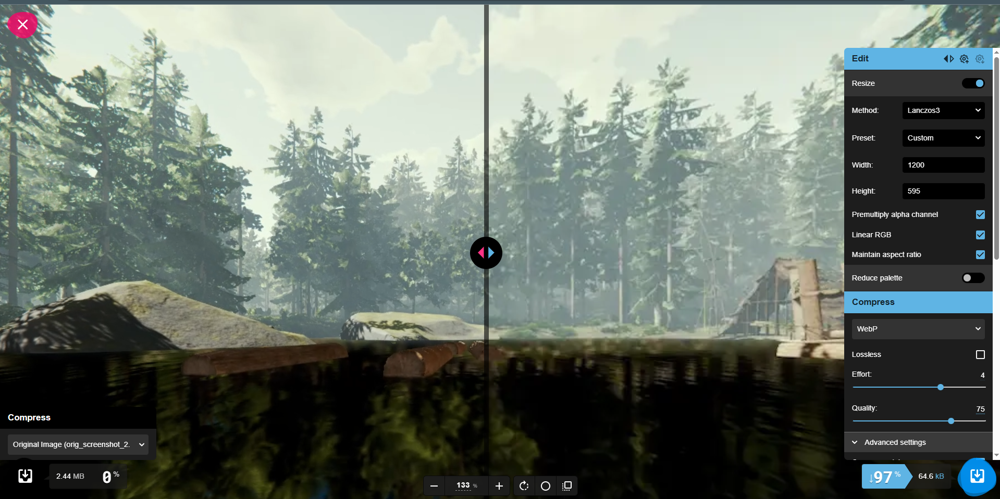
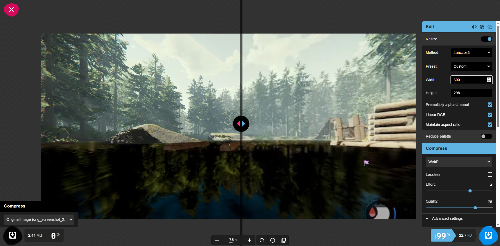
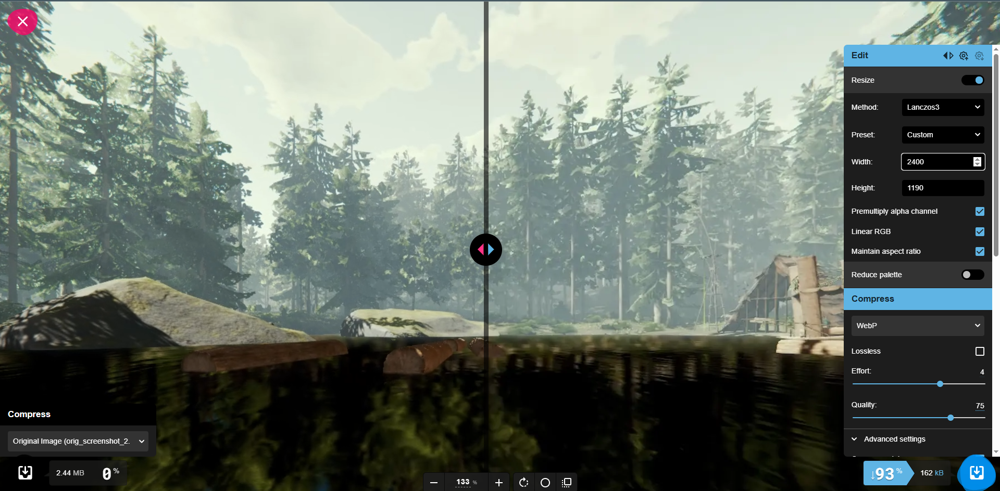

---

##### 2.4.3. Графіка — оптимізація для різних пристроїв

| Призначення | Розмір (px) | Формат | Якість | Вага файлу | Зменшення від оригіналу |
|-------------|-------------|--------|--------|------------|-------------------------|
| **Оригінал** | - | PNG | - | 172 KB | - |
| **Веб (1x)** | 1200×380 | WebP | 75% | 9.75 KB | **94.3%** |
| **Мобільні** | 600×190 | WebP | 75% | 3.79 KB | **97.8%** |
| **Retina (2x)** | 2400×760 | WebP | 75% | 35.5 KB | **79.4%** |

**Висновки**:
- Графіка з текстом дуже ефективно стискається при зміні розміру
- При 75% якості текст може бути трохи розмитим — для критичної чіткості краще використовувати 100% або lossless
- Для Retina рекомендується 100% якість або lossless для збереження чіткості тексту

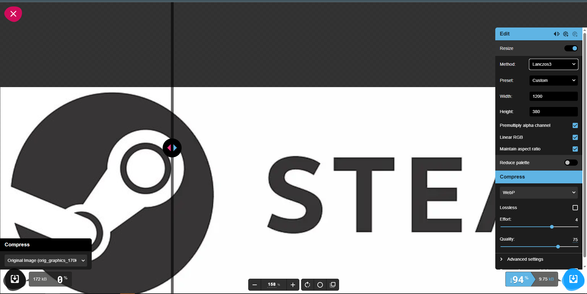
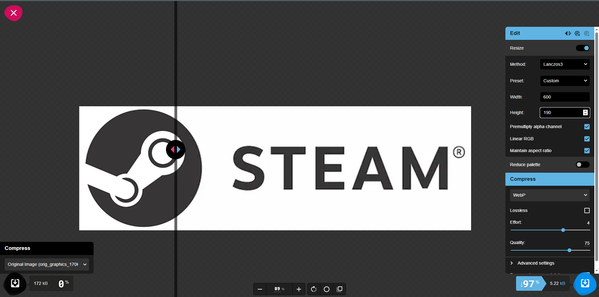
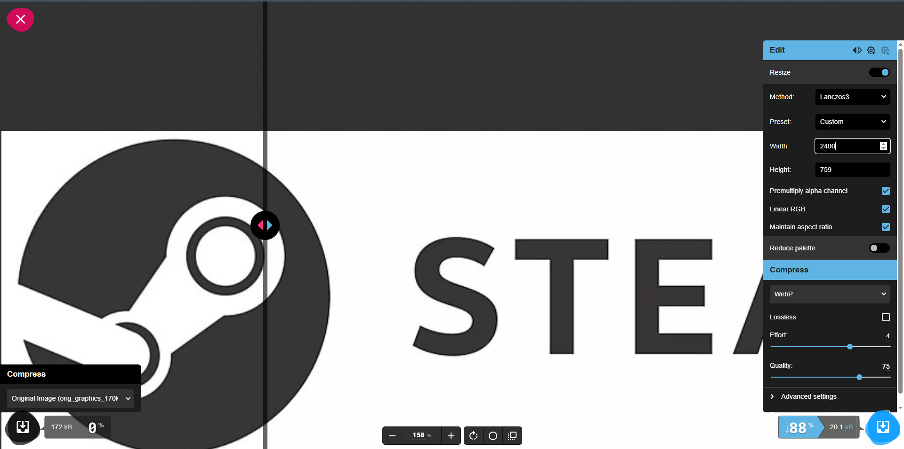

---

##### 2.4.4. Загальні висновки по оптимізації розміру

**Ключові спостереження**:

1. **Зміна розміру — найефективніший метод оптимізації**:
   - Фотографія: зменшення на 97-99% для веб/мобільних
   - Скріншот: зменшення на 97-99% для веб/мобільних
   - Графіка: зменшення на 94-98% для веб/мобільних

2. **Комбінація зміни розміру + стиснення**:
   - Дає найкращий результат: 7.51 MB → 48 KB (зменшення на 99.4%)
   - Критично важливо для мобільних пристроїв

3. **Стратегія для Retina-дисплеїв**:
   - Створювати 2x версії (2400px) з якістю 75%
   - Для графіки з текстом — використовувати 100% або lossless
   - Розмір 2x версії все одно менший за оригінал на 80-90%

5. **Економія трафіку**:
   - Мобільні користувачі завантажують 48 KB замість 7.51 MB
   - Десктоп користувачі завантажують 199 KB замість 7.51 MB
   - Retina користувачі завантажують 789 KB замість 7.51 MB
   - Середня економія: **95-99% трафіку**

---

#### 2.5. Візуальний аналіз та висновки

##### 2.5.1. Порівняльна таблиця форматів та типів стиснення

| Тип зображення | Оригінал | Lossless | Lossy 100% | Lossy 75% | Lossy 50% | Рекомендація |
|----------------|----------|----------|------------|-----------|-----------|--------------|
| **Фотографія** | 7.51 MB | 2.10 MB | 3.63 MB | 3.49 MB | 3.46 MB | **Lossy 75%** (WebP/JPEG) |
| **Скріншот** | 2.44 MB | 1.44 MB | 2.26 MB | 2.15 MB | 2.12 MB | **Lossless** (WebP/PNG) |
| **Графіка** | 172 KB | 80 KB | 37.0 KB | 10.4 KB | 8.61 KB | **Lossy 100%** (WebP) або **Lossless** (WebP) |

---

##### 2.5.2. Висновки по типах зображень

**Фотографії**:
- **Найкращий формат**: WebP (lossy) або MozJPEG
- **Оптимальна якість**: 75-85%
- **Зміна розміру**: обов'язково (1200px для веб, 600px для мобільних)
- **Retina**: 2x версія з якістю 65-70%

**Скріншоти**:
- **Найкращий формат**: WebP (lossless) або PNG
- **Оптимальна якість**: lossless або lossy 90-100%
- **Зміна розміру**: залежить від контенту (зберігати читабельність тексту)
- **Retina**: 2x версія з lossless або 95% якості

**Графіка з текстом**:
- **Найкращий формат**: WebP (lossy 100% або lossless)
- **Оптимальна якість**: 
  - Lossy 100% — 37 KB (зменшення на 79%, відмінна чіткість тексту)
  - Lossless — 80 KB (зменшення на 53%, максимальна якість)
- **Зміна розміру**: не рекомендується (може зіпсувати чіткість тексту)
- **Retina**: 2x версія з lossy 100% або lossless
- **Висновок**: Lossy 100% дає найкращий баланс (майже вдвічі менший розмір ніж lossless при відмінній якості)

---

##### 2.5.3. Вплив зміни розміру на оптимізацію

**Ключові висновки**:
1. **Зміна розміру — найефективніший спосіб оптимізації**: зменшення з 4000px до 1200px може зменшити розмір файлу на 80-90%.
2. **Комбінація зміни розміру + стиснення**: дає найкращий результат (наприклад, 1200px + WebP 75% = 90-95% зменшення).
3. **Для мобільних пристроїв**: достатньо 600-800px ширини.
4. **Для Retina**: створювати окремі 2x версії з трохи меншою якістю стиснення.

---

##### 2.5.4. Адаптація зображень для Retina-дисплеїв

**Стратегія оптимізації для Retina**:

1. **Створити 3 версії зображення**:
   - 1x (1200px) — для звичайних дисплеїв
   - 2x (2400px) — для Retina-дисплеїв
   - Mobile (600px) — для мобільних пристроїв

2. **Налаштування якості**:
   - 1x версія: 75-80% якості
   - 2x версія: 65-70% якості (висока щільність пікселів компенсує втрату якості)
   - Mobile версія: 70-75% якості

3. **Використання srcset**:
```html
<picture>
  <source media="(max-width: 600px)" srcset="image-mobile.webp">
  <source media="(min-width: 601px)" srcset="image-1x.webp 1x, image-2x.webp 2x">
  
</picture>
```

4. **Економія трафіку**:
   - Браузер автоматично вибере потрібну версію
   - Мобільні пристрої завантажать легшу версію
   - Retina-дисплеї отримають чітке зображення

---

### 3. Результат  

В результаті виконання практичної роботи я:

- **Проаналізував 3 типи зображень** (фотографія 7.51 MB, скріншот 2.44 MB, графіка 172 KB) та визначив їхні характеристики;
- **Виконав lossless стиснення** для всіх зображень:
  - Фотографія: 7.51 MB → 2.10 MB (зменшення на 72%)
  - Скріншот: 2.44 MB → 1.44 MB (зменшення на 41%)
  - Графіка: 172 KB → 80 KB (зменшення на 53%)
- **Виконав lossy стиснення** на рівнях 100%, 75%, 50%:
  - Фотографія: оптимально 75% (3.49 MB, зменшення на 54%)
  - Скріншот: оптимально lossless або 75% (2.15 MB, зменшення на 12%)
  - Графіка: оптимально 100% (37 KB, зменшення на 79%)
- **Виконав оптимізацію розміру** для різних пристроїв:
  - **Веб (1200px)**: фотографія 199 KB, скріншот 64.6 KB, графіка 9.75 KB
  - **Мобільні (600px)**: фотографія 48.4 KB, скріншот 22.7 KB, графіка 3.79 KB
  - **Retina (2400px)**: фотографія 789 KB, скріншот 248 KB, графіка 35.5 KB
- **Досяг максимального зменшення розміру**:
  - Фотографія: 7.51 MB → 48.4 KB (зменшення на **99.4%**)
  - Скріншот: 2.44 MB → 22.7 KB (зменшення на **99.1%**)
  - Графіка: 172 KB → 3.79 KB (зменшення на **97.8%**)
- **Створив порівняльні таблиці** для аналізу ефективності різних методів стиснення;
- **Визначив оптимальні стратегії** для кожного типу зображень та пристроїв;

---

## Висновок  

Під час виконання практичного завдання я:

- **Опанував роботу з Squoosh** та навчився оптимізувати зображення для веб-використання;
- **Зрозумів різницю між lossless та lossy стисненням**:
  - Lossless: зберігає якість, зменшення на 41-72%
  - Lossy: дозволяє більше стиснення, зменшення на 54-96% залежно від якості
- **Навчився визначати оптимальний баланс** між якістю зображення та розміром файлу:
  - Фотографії: WebP lossy 75% — найкращий баланс
  - Скріншоти: WebP lossless — збереження читабельності тексту
  - Графіка: WebP lossy 100% — чіткість тексту + високе стиснення (79%)
- **Дослідив вплив зміни розміру** на оптимізацію:
  - Зміна розміру + стиснення = **найефективніший метод** (зменшення на 97-99%)
  - Веб (1200px): зменшення на 97%
  - Мобільні (600px): зменшення на 99%
  - Retina (2400px): зменшення на 89%
- **Освоїв адаптацію зображень** для різних пристроїв:
  - Створення 3 версій (mobile, web, retina) для оптимального завантаження
  - Використання `<picture>` та `srcset` для адаптивних зображень
  - Економія трафіку: мобільні користувачі завантажують 48 KB замість 7.51 MB
- **Зрозумів важливість оптимізації** для швидкості завантаження сайтів та покращення UX;
- **Застосував сучасні формати** (WebP) для кращої компресії порівняно з традиційними JPEG/PNG.

---