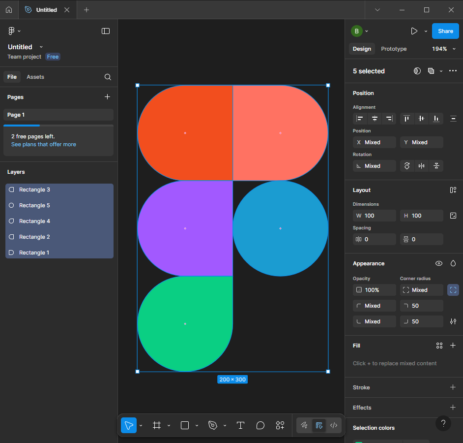

# ПЗ-2 Робота з простими формами та їх властивостями у Figma. Частина 1  

## Тема заняття
Робота з простими формами та їх властивостями у Figma (Частина 1) 

## Хід роботи  

### 1. Створення фігур  
У середовищі Figma я створив 5 прямокутників (Rectangle) для побудови логотипа.  

### 2. Зміна властивостей  
Для кожної фігури я задав розміри 100×100 px та розташував їх відповідно до зразка.  

### 3. Використання individual corners  
Я застосував індивідуальне заокруглення кутів (Mixed corner radius), щоб надати прямокутникам форму кола чи заокругленого краю. Це дозволило створити плавні переходи між елементами логотипа.  

### 4. Зміна кольору  
Кожній фігурі я надав свій колір: червоний, синій, зелений та фіолетовий, використовуючи палітру Fill.  

### 5. Результат роботи у Figma  
Я отримав готове зображення логотипа Figma, побудоване з простих фігур із використанням індивідуальних заокруглень.  

  

## Висновки  
На практиці я:  
- створив кілька фігур у Figma;  
- змінив їхні розміри та розташування;  
- використав індивідуальні заокруглення кутів для формування потрібної геометрії;  
- надав кожному елементу власний колір.  

Ця робота навчила мене:  
- працювати з базовими фігурами та їхніми властивостями у Figma;  
- застосовувати individual corners для зміни форми;  
- створювати логотипи з простих геометричних елементів.  