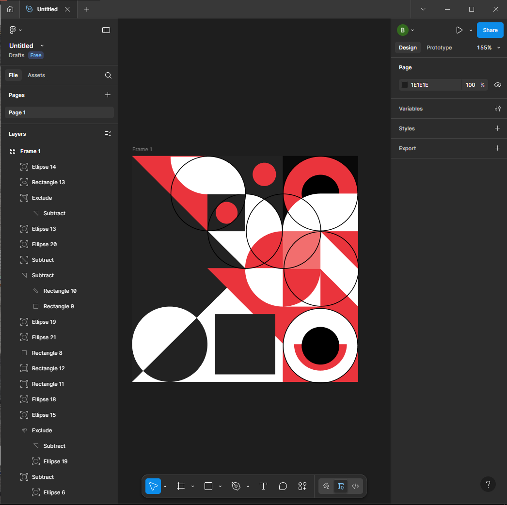

# ПЗ-3 Робота з простими формами та їх властивостями у Figma. Створення геометричного візерунку. Частина 2  

## Тема заняття
Створення геометричного візерунку.Частина 2

## Хід роботи  

### 1. Створення фрейму  
У Figma я створив фрейм розміром 400 × 400 px, який став основою для побудови візерунку.  

### 2. Заповнення фігурами  
Усередині фрейму я розмістив прості геометричні елементи — кола, півкола, трикутники та прямокутники. Комбінуючи та орієнтуючи їх по-різному, сформував декоративний візерунок.  

### 3.Використання булевих операцій  
Для створення більш складних фігур я застосував інструменти:  
- Union (об’єднання) – поєднував кілька форм в одну;  
- Subtract (віднімання) – вирізав частини з однієї фігури іншою;  
- Intersect (перетин) – залишав лише спільну частину двох форм;  
- Exclude (виключення) – формував складні контури, прибираючи місця перетину.  

Ці операції дозволили отримати унікальні елементи, яких неможливо було створити лише базовими прямими формами.

### 4. Застосування кольорів  
Для елементів я використав три основні кольори: чорний, білий та червоний. Контраст цих кольорів дозволив підкреслити структуру орнаменту й зробити його більш виразним.  

### 5. Результат роботи у Figma  
Я отримав фрагмент геометричного візерунку, побудований у межах фрейму 400 × 400 px.  

  

## Висновок  
На практиці я:  
- створив фрейм у Figma розміром 400 × 400 px;  
- заповнив його простими геометричними фігурами (кола, півкола, трикутники, прямокутники);  
- застосував контрастні кольори для формування орнаменту.  

Ця робота навчила мене:  
- працювати з фреймом як основою для композиції;  
- комбінувати прості елементи для створення складних декоративних візерунків;  
- підбирати кольорову гаму для досягнення гармонійного результату.  
