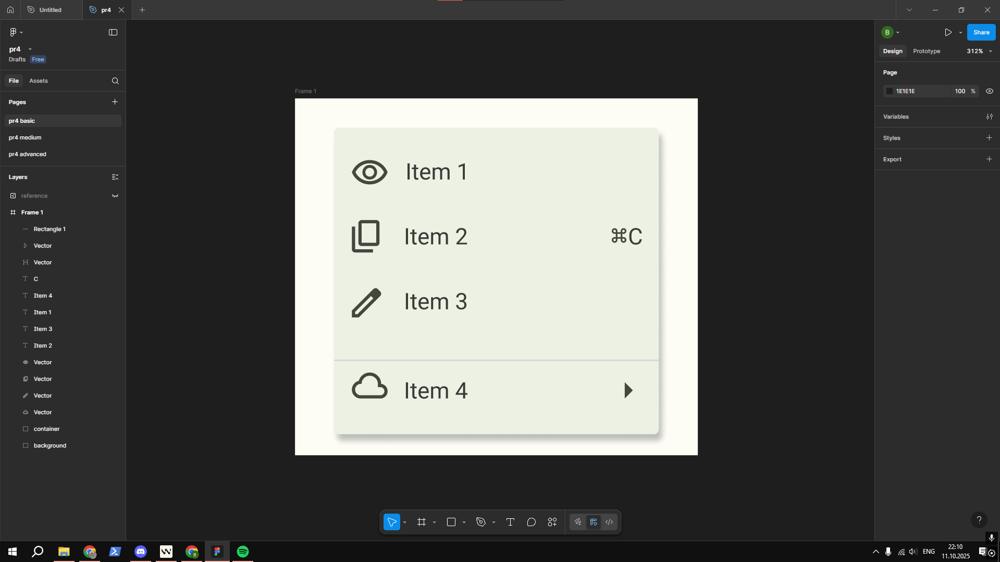

# ПЗ-4 Фрейми, групи і секції у Figma  

## Тема заняття  
Робота з фреймами, групами та секціями у Figma  

---

## Хід роботи  

### 1. Виконання завдання Basic  
Для базової частини я створив композицію з іконок, використовуючи ресурс [Google Fonts Icons](https://fonts.google.com/icons).  
Іконки були імпортовані у svg форматі у Figma та розміщені у фреймі. Для підписів до кожної іконки використав шрифт Roboto.  

  

---

### 2. Виконання завдання Medium  
Cтворення інтерфейсу аудіопрогравача.  
Основу композиції становив фрейм, у якому були розміщені елементи управління — кнопки відтворення, перемикання треків, шкала прогресу, а також зображення альбому.  
Для текстових елементів (назва треку, виконавець, час відтворення) застосував шрифт Roboto, для іконок- ресурс [Google Fonts Icons](https://fonts.google.com/icons).  

  

---

### 3. Виконання завдання Advanced  
Створення іконки браузера Google Chrome.  
Основна частина логотипа була побудована з використанням булевих операцій у Figma:  
- спочатку я створив базове коло, яке стало основою іконки;  
- далі поєднав прямокутник із шестикутником (вирівняні під певним кутом та масштабом) за допомогою операції Union;  
- отриману фігуру використав у комбінації з колом через Subtract, щоб утворити один із трьох кольорових сегментів;  

  

- аналогічну операцію повторив для інших двох сегментів, щоб отримати повну трисекторну основу;  
- кожному сегменту надав відповідний колір (червоний, жовтий, зелений);  
- у центрі розмістив синє коло з сірою рамкою.  

Усі елементи були згруповані у фреймі з градієнтом, а тіні та заокруглення додали завершеного вигляду.  

  

---

## Висновок  
На практиці я:  
- створив декілька макетів у Figma із застосуванням фреймів, груп і секцій;  
- навчився імпортувати іконки через плагіни та сторонні ресурси;  
- розробив інтерфейс аудіопрогравача з текстовими й графічними елементами;  
- створив складну іконку за допомогою булевих операцій (Union, Subtract).  

Ця робота навчила мене:  
- структурувати дизайн за допомогою фреймів, груп і секцій;  
- працювати з булевими операціями для створення складних форм;  
- застосовувати плагіни та зовнішні ресурси у процесі дизайну;  
- дотримуватись єдиної стилістики за допомогою шрифтів і кольорів.  

## [Посилання на роботу у Figma (роботи різного рівня складності знаходяться на різних сторінках "PAGE")](https://www.figma.com/design/XKeWMfdrukhDuCxJJBvJUd/pr4?m=auto&t=hxcYyG7aS07IdWQb-6)