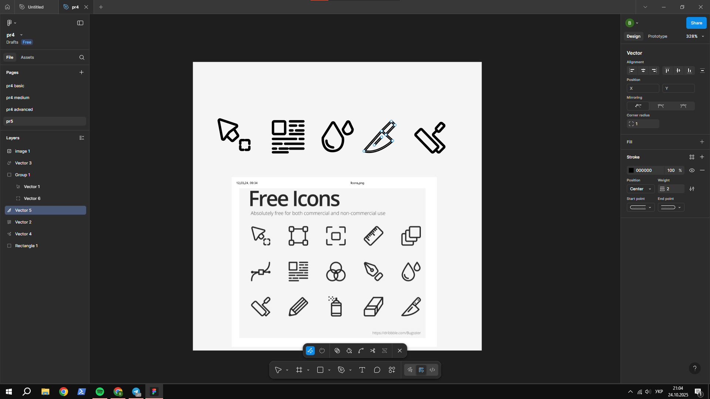

# ПЗ-5 Криві Безьє, векторні об'єкти у Figma. Створення векторних значків (іконок)

## Тема заняття  
Робота з кривими Безьє, створення векторних іконок за допомогою інструмента Pen у Figma.  

---

## Хід роботи  

### 1. Опрацювання теоретичного матеріалу  
Я опрацював розділи №9 **«Перо»** та №10 **«Векторні мережі»** з керівництва користувача Figma, у яких розглядається:  
- створення та редагування кривих Безьє за допомогою **Pen Tool**;  
- принципи роботи з векторними точками (кутові, плавні, симетричні вузли);  
- особливості побудови **векторних мереж (vector networks)**;  
- робота з контурами, обводкою (Stroke) і заокругленнями ліній.  

Для "набиття руки" перед практичною частиною я тренувався на ресурсі [The Bezier Game](https://bezier.method.ac/?authuser=0), де закріпив навички побудови плавних кривих та точного керування вузлами.

---

### 2. Виконання практичного завдання  
Для побудови іконок я використав лише **інструмент Pen (Перо)**, створюючи лінії з кривими Безьє.  
Під час роботи було застосовано:
- **Stroke Weight:** 2 pt;  
- **Stroke Cap:** Round (заокруглені кінці ліній);  
- **Stroke Join:** Round (плавне з’єднання кутів);  
- **Без заливки (Fill):** відсутня, лише контур.  

---

### 3. Результат  
У результаті створено набір із п’яти векторних іконок у єдиному обведеному стилі.  
Всі лінії побудовані вручну з використанням кривих Безьє, що дозволило досягти плавності контурів та чистоти форм.

  

---

## Висновок  
Під час виконання практичної роботи я:  
- опанував інструмент **Pen Tool** для створення кривих Безьє;  
- навчився працювати з **векторними вузлами** та керуючими лініями;  
- створив п’ять іконок у **border-стилі**, використовуючи лише обведення;  
- закріпив навички точного малювання контурів і заокруглення ліній у Figma.  

Ця робота допомогла краще зрозуміти принципи побудови векторної графіки та підготувала до створення власних UI-іконок.  

## [Посилання на роботу у Figma (сторінка "pr5")](https://www.figma.com/design/XKeWMfdrukhDuCxJJBvJUd/pr5?m=auto&t=hxcYyG7aS07IdWQb-6)
