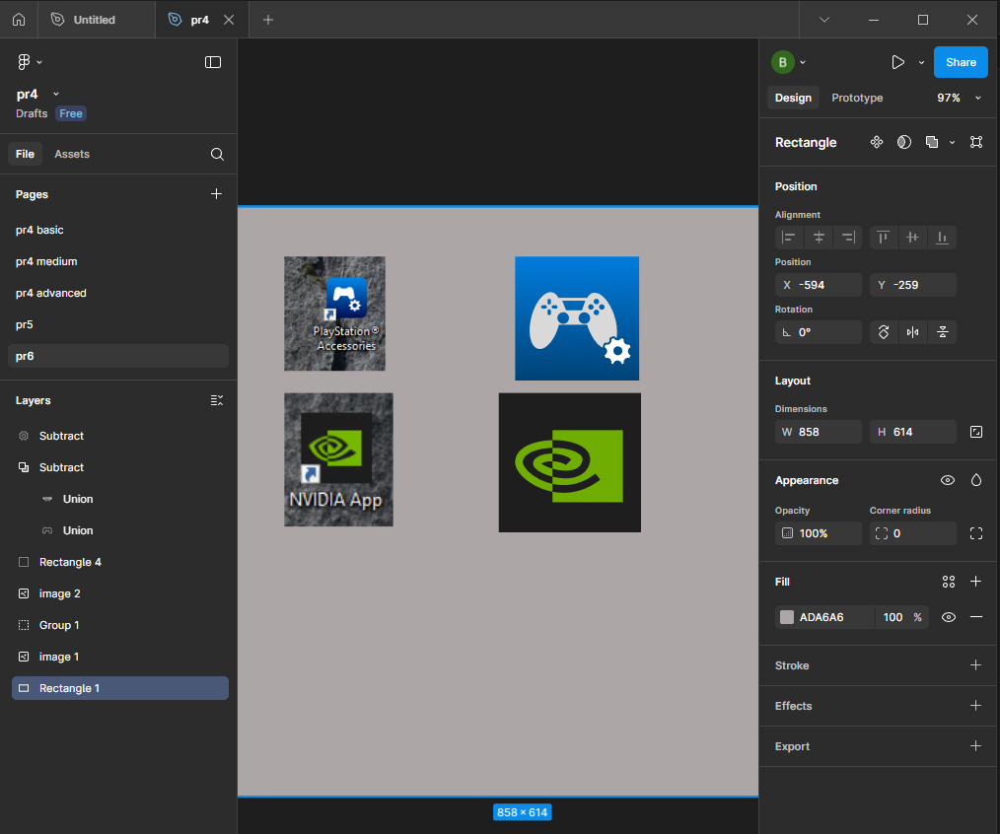

# ПЗ-6 Булеві групи і Flatten у Figma  

## Тема заняття  
Робота з **булевими групами (Boolean Groups)** та інструментом **Flatten** у Figma.  
Створення іконок у заливковому стилі (solid) за допомогою операцій додавання, віднімання, перетину та виключення фігур.  

---

## Хід роботи  

### 1. Опрацювання теоретичного матеріалу  
Я опрацював розділ №11 **«Булеві групи і Flatten»** з *«Керівництва користувача Figma»*, у якому розглядається:  
- принцип об’єднання фігур за допомогою **Boolean Groups**;  
- чотири основні типи булевих операцій:  
  - **Union (Додавання)** — об’єднання форм у єдину фігуру;  
  - **Subtract (Віднімання)** — вирізання однієї фігури з іншої;  
  - **Intersect (Перетин)** — створення фігури за спільною частиною об’єктів;  
  - **Exclude (Виключення)** — формування об’єкта за межами перетину;  
- команда **Flatten (Об’єднання у єдиний векторний шлях)** для спрощення складних композицій.  

Додатково переглянув навчальне відео:  
[**Булеві операції у Figma (YouTube)**](https://www.youtube.com/watch?v=4eaVnQA_TBk&t=5s&ab_channel=юляідизайн),  
де розглянуто приклади практичного застосування булевих груп при створенні іконок.  

---

### 2. Виконання практичного завдання  
Метою практикуму було створити **два векторні значки у заливковому стилі (solid)**, використовуючи **булеві групи** та **Flatten**.  

У роботі використано такі інструменти та прийоми:  
- **Rectangle (R)**, **Ellipse (O)** — базові геометричні форми;  
- **Boolean Groups:**  
  - *Subtract* — для вирізання частин (наприклад, шестерня з джойстика);  
  - *Union* — для поєднання кількох елементів в одну форму (логотип NVIDIA);  
- **Flatten Selection (Ctrl + E)** — для об’єднання усіх векторних шарів у єдиний шлях перед фінальним фарбуванням;  
- **Fill:** суцільна заливка кольором без обведення;  
- **Alignment Tools** — для точного вирівнювання об’єктів.  

---

### 3. Результат  
У результаті створено два заливкові векторні значки:  
1. **PlayStation Accessories Icon** — синій значок із джойстиком та шестернею, побудований через поєднання та віднімання еліпсів.  
2. **NVIDIA App Icon** — зелено-чорна іконка, створена через операції *Union* та *Subtract*, після чого застосовано Flatten для перетворення на єдиний шлях.  

Усі фігури побудовані вручну без використання растрових зображень.  
Фінальний вигляд макету подано нижче:  

  

---

## Висновок  
Під час виконання практичної роботи я:  
- опанував принципи **булевих операцій (Boolean Groups)** у Figma;  
- навчився комбінувати прості фігури для створення складних векторних іконок;  
- закріпив навички використання команди **Flatten** для оптимізації векторів;  
- створив два повноцінні **solid-значки** у власному стилі.  

Робота допомогла краще зрозуміти процес формування складних форм на основі базових геометричних елементів і є важливим кроком у вивченні побудови UI-іконок.  

---

## [Посилання на роботу у Figma (сторінка “pr6”)](https://www.figma.com/design/XKeWMfdrukhDuCxJJBvJUd/pr5?m=auto&t=hxcYyG7aS07IdWQb-6)  
