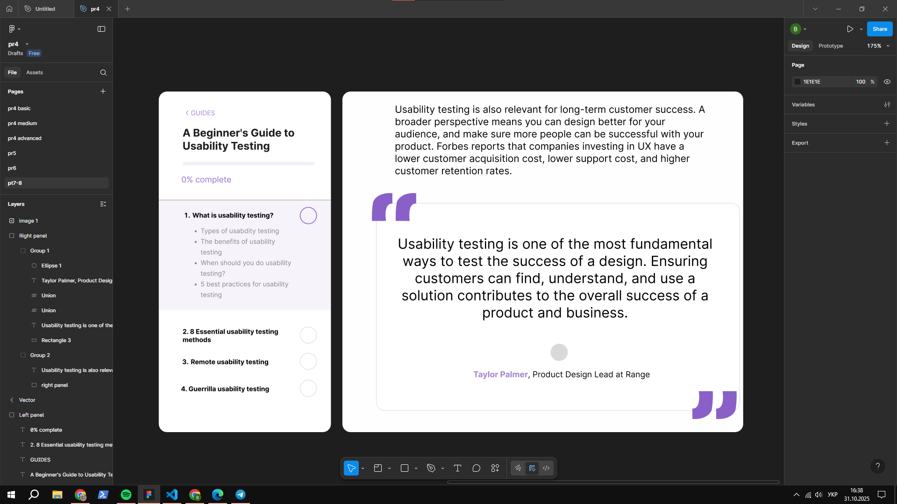

# ПЗ-7 Типографіка в дизайні інтерфейсів

## Тема заняття  
Вивчення принципів типографіки у дизайні користувацьких інтерфейсів. Аналіз поєднання шрифтів, ієрархії тексту, контрасту та зручності читання у Figma.

---

## Хід роботи  

### 1. Опрацювання теоретичного матеріалу  
Я опрацював теоретичний матеріал з документа  
[**"Типографіка в дизайні інтерфейсів"**](https://docs.google.com/document/d/1IAKGCHHd1mB2Ecz_xdSHvbygmMeIOiWp-nQBAQz_JlY/edit?usp=sharing),  
де розглянуто такі ключові аспекти:

- основні **принципи типографіки** у веб- та UI-дизайні;  
- поняття **ієрархії**, **контрасту**, **інтерліньяжу (line-height)** та **кернінгу (letter-spacing)**;  
- вплив гарнітури шрифту на сприйняття інтерфейсу;  
- правила комбінування **декількох шрифтів** у єдиній системі дизайну;  
- поняття **читабельності (readability)** та **зручності сприйняття тексту (legibility)**.  

Також я ознайомився з додатковими джерелами:  
- [ukrfonts.com](https://ukrfonts.com/index.php?v=19&authuser=0) — українські шрифти для UI-дизайну;  
- [Google Fonts](https://fonts.google.com/?authuser=0) — бібліотека безкоштовних веб-шрифтів;  
- [Типографіка у Figma (приклад макету)](https://www.figma.com/file/NXddbPnsJQ5ADUwoGdMsKh/Типографія?type=design&node-id=0%3A1&t=c7PQdggvjT85QF4j-1&authuser=0);  
- [Відео “Основи типографіки для дизайнерів”](https://www.youtube.com/watch?v=EehK2JRDtnQ&authuser=0);  
- додаткові матеріали з Google Drive:  
  - [Посібник 1](https://drive.google.com/file/d/18S1lYmeAh4xGIovg44CwhSOCngpueTV0/view?usp=classroom_web&authuser=0)  
  - [Посібник 2](https://drive.google.com/file/d/1rb-lgdkOOBgXMam6sj8aNRELAr8vgixE/view?usp=drive_link)

---

### 2. Виконання практичного завдання  
У програмі **Figma** я відтворив макет сторінки, що демонструє використання типографічних принципів у дизайні.  

Було реалізовано:  
- **ієрархію текстових блоків** (заголовок, підзаголовок, текстовий контент, цитата);  
- **контраст шрифтів** між заголовками (bold) і звичайним текстом (regular);  
- **використання кольорових акцентів** для підкреслення важливих елементів;  
- **збалансовані відступи (spacing)** та узгоджений **line-height**;  
- робота з **візуальною сіткою** для гармонійного вирівнювання елементів.

---

### 3. Результат  

#### Скріншот виконаного макету:

## Висновок  
Під час виконання практичного завдання я:  
- опанував основні принципи **типографіки у дизайні інтерфейсів**;  
- навчився створювати **ієрархічну структуру тексту**;  
- навчився поєднувати шрифти, добирати розміри, міжрядкові інтервали та відступи;  
- застосував типографічні прийоми для підвищення **читабельності та зручності сприйняття тексту**.

Ця робота допомогла зрозуміти, як за допомогою типографіки можна покращити UX/UI складову інтерфейсу.

---

## [Посилання на роботу у Figma (сторінка “pr7”)](https://www.figma.com/design/XKeWMfdrukhDuCxJJBvJUd/pr5?m=auto&t=hxcYyG7aS07IdWQb-6)
