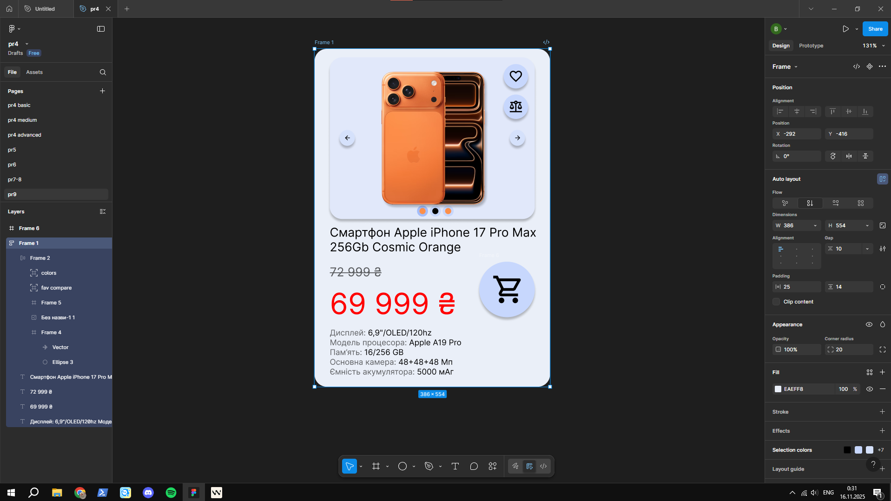
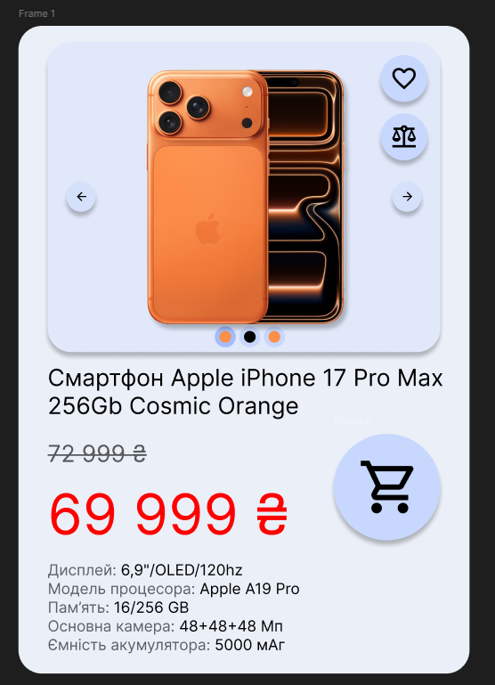

# ПЗ-9 Функція Auto layout у Figma. Створення картки товару

## Тема заняття  
Практика використання **Auto layout** у Figma на прикладі **картки товару**: робота з відступами, вирівнюванням, вкладеними авто-лейаутами та поєднанням зображення, тексту й іконок.

---

## Хід роботи  

### 1. Опрацювання теоретичного матеріалу  
Коротко опрацював матеріали по темі **Auto layout**:

- створення гнучких контейнерів;  
- налаштування напрямку, відступів та вирівнювання;  
- використання вкладених авто-лейаутів для карток і списків товарів.

### 2. Виконання практичного завдання  
Створив **картку смартфона Apple iPhone 17 Pro Max 256Gb Cosmic Orange** з використанням Auto layout.

Основні кроки:

- фрейм-картка з м’яким фоном і закругленими кутами;  
- вертикальний Auto layout для розміщення зображення, назви, ціни та опису;  
- блок іконок дій у правій частині;  
- стара ціна та акційна **«69 999 ₴»** у горизонтальному Auto layout;  
- список основних характеристик (екран, пам’ять, камера, акумулятор);  
- кнопка «кошика» з іконкою.

У роботі використано **Frame**, базові фігури, Auto layout, налаштування відступів і тіней.

---

### 3. Результат  
Отримано **компактну картку товару**, в якій при зміні тексту або ціни структура зберігається завдяки Auto layout.

#### Скріншот виконаної роботи:

---

## Висновок  
Під час ПЗ-9 я закріпив роботу з **Auto layout**, навчився будувати гнучку картку товару з текстом, зображенням та іконками та зрозумів, як такий підхід спрощує редагування й повторне використання компонентів в інтерфейсі.

---

## [Посилання на роботу у Figma (сторінка “pr9”)](https://www.figma.com/design/XKeWMfdrukhDuCxJJBvJUd/pr5?m=auto&t=hxcYyG7aS07IdWQb-6)
